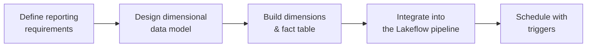

# Data Transformation (Gold) - Section Overview

So far we've built a strong, reliable data foundation: raw data in **bronze**, then
cleaned and standardized data in **silver**. The silver data is trustworthy and
production-ready - but it's still **not designed for reporting**.

## The gap silver leaves

Silver tables are structured around the **source systems**, not the **business
questions**. The shift to designing tables around business questions is what the
**gold** layer is all about. In this section we move from **data processing** to
**data modeling**.

Instead of thinking in datasets (drivers, races, results), we think in **outcomes and
insights**:

- How do we calculate yearly **driver standings**?
- How do we analyze **constructor dominance** across multiple seasons?
- How do we support efficient analytical queries **without** repeatedly building
  complex joins?

Answering these properly needs a structured analytical model - **dimensional
modeling** - built for performance, clarity, and long-term maintainability.

## What this section covers

| Topic | Focus |
| --- | --- |
| **Requirements & the gold layer** | Why gold, and what it must support. |
| **Dimensional modeling** | Facts vs dimensions, the star schema. |
| **Dimensions & fact** | Build `dim_races`, `dim_constructors`, `dim_drivers`, `fact_session_results`. |
| **Orchestration & triggers** | Add gold tasks to the Lakeflow job; schedule, file, and table triggers; notifications. |

This is the stage where the lakehouse becomes **more than a data pipeline** - a
complete analytical solution. Let's get started.

## References

- [Spark SQL join syntax](https://spark.apache.org/docs/latest/sql-ref-syntax-qry-select-join.html)
- [PySpark DataFrame.unionByName](https://spark.apache.org/docs/latest/api/python/reference/pyspark.sql/api/pyspark.sql.DataFrame.unionByName.html)
- [Lakeflow Jobs](https://learn.microsoft.com/en-us/azure/databricks/workflows/jobs/jobs)
- [Trigger jobs when new files arrive](https://learn.microsoft.com/en-us/azure/databricks/jobs/file-arrival-triggers)
- [Trigger jobs when source tables are updated](https://learn.microsoft.com/en-us/azure/databricks/jobs/trigger-table-update)
- [Job notifications](https://learn.microsoft.com/en-us/azure/databricks/jobs/notifications)
