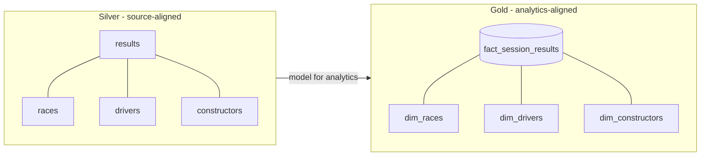

# Reporting Requirements & Why Gold

Dimensional modeling should always be **driven by requirements**, so let's be clear
about what the gold layer must support.

## Reporting requirements

| # | Requirement |
| --- | --- |
| 1 | **Driver standings** per race year - total points per driver per season, plus their ranking within the season. |
| 2 | **Constructor standings** per race year - same aggregation, grouped by constructor. |
| 3 | Analyze **dominant drivers and constructors over time** - trends across **multiple** seasons. |
| 4 | Support analysis across both **recent** and **historical** seasons - the design must **scale across many years** without structural changes. |
| 5 | The final datasets must support **efficient reporting and analytical queries** - able to feed dashboards/BI tools, not just a single notebook. |

!!! tip "Plan for geography"
    The core requirements don't mention geography, but analytical questions often
    evolve toward it (e.g. comparing performance by region). To stay flexible, we'll
    enrich drivers and constructors with a **region attribute** derived from
    nationality.

From these requirements, the model must support: **season-level aggregates**,
**ranking logic** within each season, **clear descriptive context** for drivers /
constructors / races, and a structure that makes those queries simple and performant.

## Do we even need a gold layer?

Silver is clean, validated, and well-structured - so technically we *could* query it
directly (join results with races, drivers, constructors; aggregate; rank with window
functions). That **works**, but working isn't the same as **well-designed**.

The issue isn't *whether* silver can support reporting - it's that silver is organized
around **source-aligned datasets**, reflecting how data was ingested and transformed,
**not** how analysts and business users think. Exposing silver directly forces users
to understand the joins, entity relationships, and granularity - coupling reporting
logic to your transformation design.

!!! note "What gold provides"
    The gold layer organizes data into a **dimensional model** intentionally designed
    for analytics - a **star schema** with a central fact table and surrounding
    dimensions, well-defined granularity, and clear relationships. This gives
    **semantic clarity**: analysts query a model built for reporting, without
    reasoning about bronze/silver transformation logic.

## What's next

Next we introduce dimensional modeling formally and design our fact and dimension
tables. Continue to [Dimensional Data Modeling](03_dimensional-data-modeling.md).

## References

- [Spark SQL join syntax](https://spark.apache.org/docs/latest/sql-ref-syntax-qry-select-join.html)
- [PySpark DataFrame.unionByName](https://spark.apache.org/docs/latest/api/python/reference/pyspark.sql/api/pyspark.sql.DataFrame.unionByName.html)
- [Lakeflow Jobs](https://learn.microsoft.com/en-us/azure/databricks/workflows/jobs/jobs)
- [Trigger jobs when new files arrive](https://learn.microsoft.com/en-us/azure/databricks/jobs/file-arrival-triggers)
- [Trigger jobs when source tables are updated](https://learn.microsoft.com/en-us/azure/databricks/jobs/trigger-table-update)
- [Job notifications](https://learn.microsoft.com/en-us/azure/databricks/jobs/notifications)
