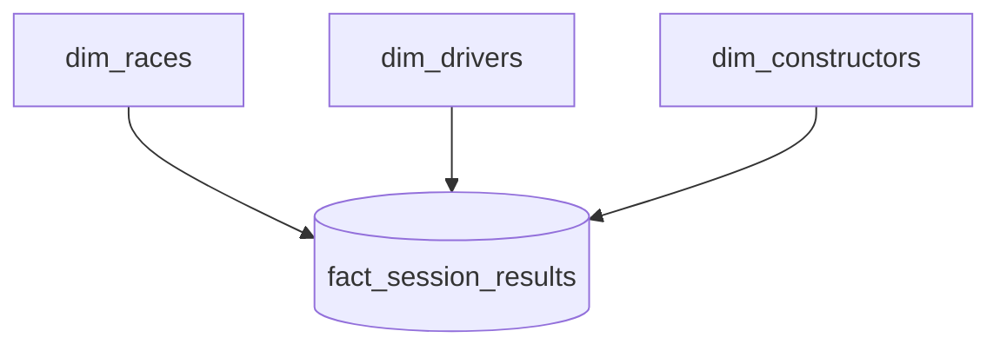
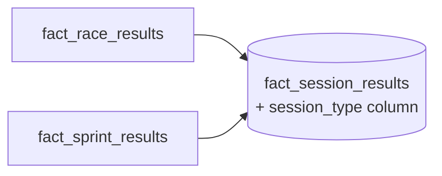

# Dimensional Data Modeling

Dimensional modeling isn't about creating *more* tables - it's about organizing data so
analytical queries are **simple, intuitive, and efficient**. At its core, it separates
data into **facts** and **dimensions**.

## Facts vs dimensions

| | Facts | Dimensions |
| --- | --- | --- |
| **Represent** | Measurable **events** | Descriptive **context** |
| **Contain** | Keys + numeric measures at the lowest granularity | Descriptive attributes (who/what/where/when) |
| **F1 example** | A race result (points, position, laps) | Driver, constructor, race |

A **race result** is an event involving a driver and constructor in a race - a
**fact**. The driver, constructor, and race describe that event - **dimensions**.

## The star schema

A central **fact table** surrounded by **dimension tables** connected by keys forms a
**star schema**. It suits the predictable analytical pattern - *filter by dimension
attributes, aggregate fact measures, group by descriptive fields* - and it simplifies
joins, improves readability, and works well with BI tools.

## Applying it to Formula 1

| Question | Answer | Table |
| --- | --- | --- |
| What's the primary event? | Race results (points, position, laps) | **fact** |
| What was the result related to? | The race (name, circuit) | `dim_races` |
| Who does the result belong to? | The driver & constructor | `dim_drivers`, `dim_constructors` |

The first fact table is **`fact_race_results`**, with a granularity of **one record per
driver per race**.

!!! note "Granularity matters"
    Always define the fact table's **granularity** - exactly what one row represents.
    Here it's *one driver, one race, one result*.

## Combining race and sprint results

Formula 1 also has sprint races, so we could add a second fact table
`fact_sprint_results`. But since race and sprint results have **the same columns** and
**the same granularity** (one row per driver per race), we can **combine** them into a
single fact table:

The combined table - **`fact_session_results`** - adds a **`session_type`** column
(`race` or `sprint`).

!!! tip "Why combine?"
    It makes analysts' lives easier - total points per driver per season can be
    computed from **one** table instead of combining two. This works **only** because
    both tables share the same granularity and columns.

## The final gold model

One fact table (`fact_session_results`) surrounded by three dimensions (races,
drivers, constructors) - supporting season-level aggregates, ranking, descriptive
context, and simple, performant queries.

## What's next

Next we build the first dimension. Continue to [Building the Races Dimension](04_dimension.md).

## References

- [Spark SQL join syntax](https://spark.apache.org/docs/latest/sql-ref-syntax-qry-select-join.html)
- [PySpark DataFrame.unionByName](https://spark.apache.org/docs/latest/api/python/reference/pyspark.sql/api/pyspark.sql.DataFrame.unionByName.html)
- [Lakeflow Jobs](https://learn.microsoft.com/en-us/azure/databricks/workflows/jobs/jobs)
- [Trigger jobs when new files arrive](https://learn.microsoft.com/en-us/azure/databricks/jobs/file-arrival-triggers)
- [Trigger jobs when source tables are updated](https://learn.microsoft.com/en-us/azure/databricks/jobs/trigger-table-update)
- [Job notifications](https://learn.microsoft.com/en-us/azure/databricks/jobs/notifications)
