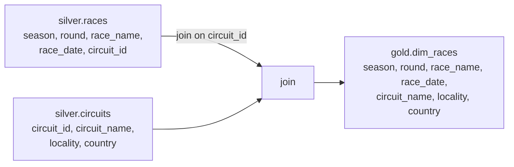

# Building the Races Dimension

The first dimension is **`dim_races`**, which requires joining two silver tables.

## Source → target



`dim_races` has primary key **(season, round)**, plus `race_name`, `race_date`, and -
instead of `circuit_id` - the descriptive `circuit_name`, `locality`, and `country`
brought in by joining `silver.races` to `silver.circuits` on `circuit_id`.

## Requirements

1. Read `silver.races` and `silver.circuits`.
2. **Join** the two on `circuit_id`.
3. Select the required columns.
4. Write to `gold.dim_races`.

## Reading the source tables

```python
%run ../00-common/01.environment-config
from pyspark.sql import functions as F

target_table = f"{catalog_name}.{gold_schema}.dim_races"

circuits_df = spark.table(f"{catalog_name}.{silver_schema}.circuits")
races_df    = spark.table(f"{catalog_name}.{silver_schema}.races")
```

## The `join` method

`df.join(other, on, how)` joins two DataFrames:

| Parameter | Meaning |
| --- | --- |
| **other** | The other DataFrame. |
| **on** | Join condition (omit → Cartesian product). |
| **how** | Join type - default **`inner`** (more types in the [next lesson](05_joins.md)). |

```python
dim_races_df = races_df.join(
    circuits_df,
    races_df.circuit_id == circuits_df.circuit_id,   # double == in Python
    "inner",
)
```

!!! warning "Qualify ambiguous columns"
    Because `circuit_id` exists in **both** DataFrames, qualify it with the DataFrame
    name (`races_df.circuit_id`) - otherwise Spark raises an *ambiguous column* error.
    The join condition uses `==` (Python), not `=`.

## Selecting required columns

The join returns **all** columns from both DataFrames (with duplicates like
`circuit_id` and unwanted metadata). Use `select`, qualifying by DataFrame:

```python
dim_races_df = dim_races_df.select(
    races_df.season,
    races_df.round,
    races_df.race_name,
    races_df.race_date,
    circuits_df.circuit_name,
    circuits_df.locality,
    circuits_df.country,
)
```

## Writing the dimension

```python
(
    dim_races_df.write
    .format("delta")
    .mode("overwrite")        # full refresh
    .saveAsTable(target_table)
)
```

!!! note "Always set `mode("overwrite")`"
    For a full refresh, include `mode("overwrite")` - otherwise the second run appends
    (or fails). (Easy to forget!)

`gold.dim_races` now holds exactly the required columns.

## What's next

Before more dimensions, a primer on join types. Continue to [Joins](05_joins.md).

## References

- [Spark SQL join syntax](https://spark.apache.org/docs/latest/sql-ref-syntax-qry-select-join.html)
- [PySpark DataFrame.unionByName](https://spark.apache.org/docs/latest/api/python/reference/pyspark.sql/api/pyspark.sql.DataFrame.unionByName.html)
- [Lakeflow Jobs](https://learn.microsoft.com/en-us/azure/databricks/workflows/jobs/jobs)
- [Trigger jobs when new files arrive](https://learn.microsoft.com/en-us/azure/databricks/jobs/file-arrival-triggers)
- [Trigger jobs when source tables are updated](https://learn.microsoft.com/en-us/azure/databricks/jobs/trigger-table-update)
- [Job notifications](https://learn.microsoft.com/en-us/azure/databricks/jobs/notifications)
