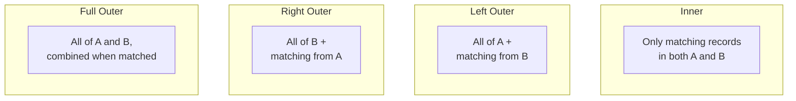

# Joins

This lesson introduces the main **join types**. Joins combine two (or more) tables
using a **join condition** - here, Table A and Table B both have an `id` column.

Some records exist only in A, some only in B, and some in **both**. Different
requirements need different join types:



## The four major join types

| Join type | Returns |
| --- | --- |
| **Inner join** | Only records that **match in both** tables (the default; used for `dim_races`). |
| **Left outer join** | **All** of the left table + matching records from the right (non-matches get nulls on the right). |
| **Right outer join** | **All** of the right table + matching records from the left. |
| **Full outer join** | **All** records from **both** tables; combined into one row where they match. |

!!! info "Left vs right"
    The table on the **left** of the join keyword is the "left" table; the one on the
    **right** is the "right" table. A **left** outer join keeps everything from the
    left; a **right** outer join keeps everything from the right.

## In Spark

The join type is the third argument to `join` (`"inner"`, `"left"` / `"left_outer"`,
`"right"` / `"right_outer"`, `"full"` / `"full_outer"`):

```python
df_a.join(df_b, df_a.id == df_b.id, "left_outer")
```

!!! note "Why this matters next"
    For the constructors and drivers dimensions we'll use a **left outer join** to a
    manually-built nationality-region reference table - so constructor/driver records
    aren't dropped if their nationality is missing from the reference.

## What's next

Next we build the constructors dimension using a left outer join. Continue to
[Building the Constructors Dimension](06_constructors-dimension.md).

## References

- [Spark SQL join syntax](https://spark.apache.org/docs/latest/sql-ref-syntax-qry-select-join.html)
- [PySpark DataFrame.unionByName](https://spark.apache.org/docs/latest/api/python/reference/pyspark.sql/api/pyspark.sql.DataFrame.unionByName.html)
- [Lakeflow Jobs](https://learn.microsoft.com/en-us/azure/databricks/workflows/jobs/jobs)
- [Trigger jobs when new files arrive](https://learn.microsoft.com/en-us/azure/databricks/jobs/file-arrival-triggers)
- [Trigger jobs when source tables are updated](https://learn.microsoft.com/en-us/azure/databricks/jobs/trigger-table-update)
- [Job notifications](https://learn.microsoft.com/en-us/azure/databricks/jobs/notifications)
