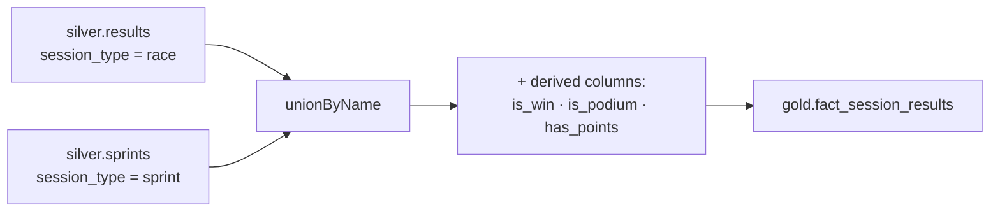

# Building the Results Fact Table

The **`fact_session_results`** table is different from the dimensions - it **combines**
two silver tables and adds **derived columns**.

## Requirements



| Requirement | Detail |
| --- | --- |
| **Combine** | All records from `results` (session_type = `race`) **and** `sprints` (session_type = `sprint`). |
| **Drop descriptive columns** | `race_date`, `race_name` belong in `dim_races`; also drop `ingestion_timestamp`, `source_file`. |
| **Derived columns** | `is_win`, `is_podium`, `has_points`. |

!!! info "Why derived columns?"
    Pre-computed booleans make analytical queries easy. To count a driver's wins in a
    season, an analyst just filters `season`, `driver_id`, and `is_win = true` - no
    complex expressions needed. They're common in fact tables and driven by business
    needs.

## Adding `session_type` and dropping columns

Use `withColumn` with `F.lit(...)` to add a **literal** value to every row (a Python
string must be wrapped in `lit` to become a column expression):

```python
results_df = (
    spark.table(f"{catalog_name}.{silver_schema}.results")
    .withColumn("session_type", F.lit("race"))
    .drop("race_date", "race_name", "ingestion_timestamp", "source_file")
)

sprints_df = (
    spark.table(f"{catalog_name}.{silver_schema}.sprints")
    .withColumn("session_type", F.lit("sprint"))
    .drop("race_date", "race_name", "ingestion_timestamp", "source_file")
)
```

## Combining with `unionByName`

Spark offers `union`, `unionAll`, and `unionByName`:

| Method | Behaviour |
| --- | --- |
| `union` | Combines by **position**, **not** column names. Doesn't remove duplicates. |
| `unionAll` | Just an **alias** for `union` (same behaviour). |
| `unionByName` | Combines by **column name** - predictable. Optional `allowMissingColumns=True` fills absent columns with null. |

!!! warning "Prefer `unionByName`"
    `union` matches columns by **position**, so if column order differs you get wrong
    values. **`unionByName`** matches by name - always prefer it (as long as columns
    are named correctly). Note: **none** of these remove duplicates - use `distinct()`
    explicitly if needed.

```python
results_sprints_df = results_df.unionByName(sprints_df)
```

Both DataFrames have identical columns here, so no `allowMissingColumns` needed.

## Adding the derived columns

```python
fact_session_results_df = (
    results_sprints_df
    .withColumn("is_win", F.col("final_position") == 1)
    .withColumn("is_podium", F.col("final_position").between(1, 3))
    .withColumn("has_points", F.col("points") > 0)
)
```

| Column | Logic |
| --- | --- |
| `is_win` | `final_position == 1` |
| `is_podium` | `final_position` between 1 and 3 |
| `has_points` | `points > 0` |

Each returns a boolean. (E.g. a driver finishing 1st with 25 points has all three
`true`.)

## Writing the fact table

```python
fact_session_results_df.write.format("delta").mode("overwrite").saveAsTable(target_table)
```

`gold.fact_session_results` now contains race **and** sprint results, the
`session_type` flag, and the three derived columns.

## What's next

With all gold tables built, we integrate them into the Lakeflow job. Continue to
[Adding Gold Tasks to the Job](09_gold-layer-tasks.md).

## References

- [Spark SQL join syntax](https://spark.apache.org/docs/latest/sql-ref-syntax-qry-select-join.html)
- [PySpark DataFrame.unionByName](https://spark.apache.org/docs/latest/api/python/reference/pyspark.sql/api/pyspark.sql.DataFrame.unionByName.html)
- [Lakeflow Jobs](https://learn.microsoft.com/en-us/azure/databricks/workflows/jobs/jobs)
- [Trigger jobs when new files arrive](https://learn.microsoft.com/en-us/azure/databricks/jobs/file-arrival-triggers)
- [Trigger jobs when source tables are updated](https://learn.microsoft.com/en-us/azure/databricks/jobs/trigger-table-update)
- [Job notifications](https://learn.microsoft.com/en-us/azure/databricks/jobs/notifications)
