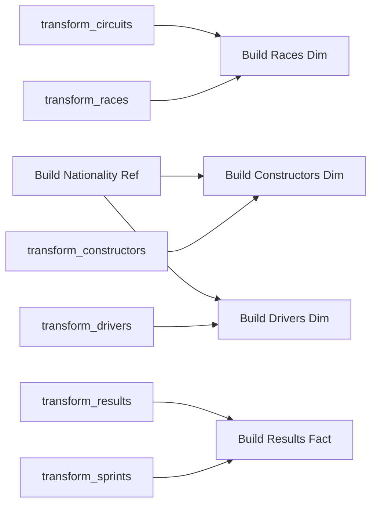

# Adding Gold Tasks to the Job

With all the gold notebooks built, we add them to the existing Lakeflow job so the
whole pipeline runs as an orchestrated, schedulable workflow.

## The gold tasks and their dependencies

We add five tasks. Each gold task depends on the **silver** tasks that produce its
source tables:

| Task | Depends on |
| --- | --- |
| **Build Nationality Region Reference** | *(none - standalone)* |
| **Build Races Dimension** | transform_circuits_data + transform_races_data |
| **Build Constructors Dimension** | transform_constructors_data + Build Nationality Region Reference |
| **Build Drivers Dimension** | transform_drivers_data + Build Nationality Region Reference |
| **Build Results Fact** | transform_results_data + transform_sprints_data |

## Adding a task

For each notebook: **Add task → Notebook**, set a name (dots aren't allowed - use
underscores, e.g. `02_Build_Races_Dimension`), select the notebook path under the
`gold` folder, choose the **Job cluster** as compute, and set the **Depends on**
tasks.

!!! tip "Standalone vs auto-dependency"
    When you add a task while another is selected, Databricks auto-adds a dependency on
    it. To create a **standalone** task (like the nationality reference), click in the
    empty job pane first so nothing is selected, then add it. You can select **multiple**
    dependencies for a single task.

!!! note "One-off reference table"
    The nationality-region reference is one-off data. In a real project you might build
    it in a **separate** job/schedule; here we keep it simple and run it as a
    standalone (no-dependency) task in the same job - so it runs in parallel with the
    bronze tasks.

## Running the complete pipeline

Click **Run now** → **View run**. The execution respects all dependencies:

1. Bronze tasks + the nationality reference run first (in parallel, no dependencies).
2. Silver tasks run after their bronze tasks.
3. Gold tasks run once their silver (and reference) dependencies succeed.

The whole job succeeds - the gold layer is now fully integrated into the Lakeflow job
(bronze → silver → gold).

!!! info "Run-if conditions"
    Dependencies use **All succeeded** by default (wait for all upstream tasks to
    succeed). Other conditions exist for more complex pipelines.

## What's next

In production we wouldn't run this manually - we'd use **triggers**. Continue to
[Scheduled Trigger](10_schedule-trigger.md).

## References

- [Spark SQL join syntax](https://spark.apache.org/docs/latest/sql-ref-syntax-qry-select-join.html)
- [PySpark DataFrame.unionByName](https://spark.apache.org/docs/latest/api/python/reference/pyspark.sql/api/pyspark.sql.DataFrame.unionByName.html)
- [Lakeflow Jobs](https://learn.microsoft.com/en-us/azure/databricks/workflows/jobs/jobs)
- [Trigger jobs when new files arrive](https://learn.microsoft.com/en-us/azure/databricks/jobs/file-arrival-triggers)
- [Trigger jobs when source tables are updated](https://learn.microsoft.com/en-us/azure/databricks/jobs/trigger-table-update)
- [Job notifications](https://learn.microsoft.com/en-us/azure/databricks/jobs/notifications)
