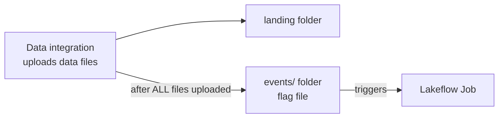

# File Arrival Trigger

Sometimes we want the pipeline to start **when new data arrives** rather than at a
fixed time. The **file arrival** trigger runs the job when a file appears in a
monitored storage location.

## The "incomplete batch" problem

In many pipelines, files arrive **one by one**. Our Formula 1 pipeline expects ~7
files (circuits, races, constructors, drivers, results, sprints). If the job triggers
as soon as the **first** file arrives, the rest may still be uploading - causing
failures or incomplete results.

!!! tip "The flag-file handshake"
    A common solution: after **all** data files are uploaded, the data-integration
    tool writes a **flag file** (a.k.a. success file) into a dedicated `events`
    folder. The Lakeflow job monitors that folder, so it runs **only when the batch is
    complete**. Flag files often encode a date or batch ID (e.g.
    `batch_complete_001.flag`).

## Configuring the trigger

1. Create an `events` folder (e.g. under the landing volume).
2. **Add trigger → File arrival**, and specify the location to monitor - a Unity
   Catalog **volume path** or an `abfss://` path (copy the `events` volume path from
   Catalog).
3. Click **Test** (should succeed), then **Save**.

!!! info "Evaluated every minute"
    The file arrival trigger is evaluated **once a minute**. With no file present, it
    evaluates but doesn't trigger.

## Triggering a run

Upload a file (any file - even empty) to the monitored folder, e.g.
`batch_complete_001.flag`. On the next evaluation the job runs, and the **Launched**
column shows **By file arrival**. Uploading another file (e.g.
`batch_complete_002.flag`) triggers another run.

!!! tip "Cancelling a run"
    To stop a running job: **Cancel job run → Cancel run**. The run shows status
    **Canceled** with error code *user canceled* - handy if you started a job by
    accident.

## Summary

Using an event/flag file to signal batch completion ensures the pipeline starts
**only after** all data files are delivered - more reliable and closer to real
production pipelines.

## What's next

Next, the related table update trigger. Continue to
[Table Update Trigger](12_table-update-trigger.md).

## References

- [Spark SQL join syntax](https://spark.apache.org/docs/latest/sql-ref-syntax-qry-select-join.html)
- [PySpark DataFrame.unionByName](https://spark.apache.org/docs/latest/api/python/reference/pyspark.sql/api/pyspark.sql.DataFrame.unionByName.html)
- [Lakeflow Jobs](https://learn.microsoft.com/en-us/azure/databricks/workflows/jobs/jobs)
- [Trigger jobs when new files arrive](https://learn.microsoft.com/en-us/azure/databricks/jobs/file-arrival-triggers)
- [Trigger jobs when source tables are updated](https://learn.microsoft.com/en-us/azure/databricks/jobs/trigger-table-update)
- [Job notifications](https://learn.microsoft.com/en-us/azure/databricks/jobs/notifications)
