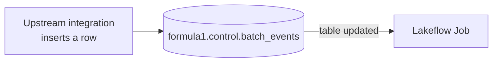

# Table Update Trigger

The **table update** trigger is another event-based trigger. It works like the file
arrival trigger, but fires when **data arrives in a monitored table** rather than a
storage location.



## Setup: a control table

To demonstrate, create a control table to monitor. A setup notebook (under `01-setup`,
e.g. *Setup Batch Events*) creates a `control` schema and a `batch_events` table:

```sql
CREATE SCHEMA IF NOT EXISTS formula1.control;

CREATE TABLE IF NOT EXISTS formula1.control.batch_events (
    batch_id INT
);
```

!!! note "In production"
    The **upstream integration solution** would insert a record into this table, and
    your job would start. Here we insert records manually to demonstrate.

## Configuring the trigger

1. **Edit trigger** → change type to **Table update**.
2. Provide a **fully qualified** table name: `formula1.control.batch_events`. You can
   **Add table** for multiple tables (with an option for *all updated* vs *any
   updated*).
3. **Test trigger** (should succeed), then **Save**.

!!! info "Evaluated every minute"
    Like file arrival, the table update trigger is evaluated **once a minute**. With
    no new data, it evaluates but doesn't trigger.

## Triggering a run

Insert a record:

```sql
INSERT INTO formula1.control.batch_events VALUES (1);
```

On the next evaluation, the job runs - the **Launched** column shows **By table
update**. As with file arrival, each update to the monitored table triggers the job.

## What's next

Finally, configuring job notifications. Continue to [Job Notifications](13_job-notifications.md).

## References

- [Spark SQL join syntax](https://spark.apache.org/docs/latest/sql-ref-syntax-qry-select-join.html)
- [PySpark DataFrame.unionByName](https://spark.apache.org/docs/latest/api/python/reference/pyspark.sql/api/pyspark.sql.DataFrame.unionByName.html)
- [Lakeflow Jobs](https://learn.microsoft.com/en-us/azure/databricks/workflows/jobs/jobs)
- [Trigger jobs when new files arrive](https://learn.microsoft.com/en-us/azure/databricks/jobs/file-arrival-triggers)
- [Trigger jobs when source tables are updated](https://learn.microsoft.com/en-us/azure/databricks/jobs/trigger-table-update)
- [Job notifications](https://learn.microsoft.com/en-us/azure/databricks/jobs/notifications)
