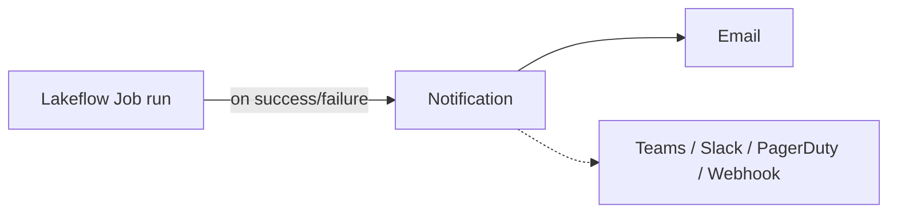

# Job Notifications

Databricks lets you configure notifications at both the **job** level and the **task**
level. This lesson configures **job-level** notifications (task-level is nearly
identical).

## Adding a notification

**Edit notifications → Add notification**. Supported destinations:

| Destination |
| --- |
| Email |
| Microsoft Teams |
| PagerDuty |
| Slack |
| Webhook |

Configure an **email** address and choose the events to notify on:

| Event | Notify? |
| --- | --- |
| **Start** | (optional) |
| **Success** | ✅ |
| **Failure** | ✅ |
| **Duration / streaming backlog** | requires configuring **metric thresholds** |

Select **Success** and **Failure**, then **Save**. The job will now email on success
or failure.

## Testing it

Trigger a run (e.g. insert another row to fire the table update trigger from the
previous lesson). When the job finishes, an email arrives stating the job **succeeded**
and that it was **launched by a table update trigger**, with a link to **view the run
in Databricks**.

!!! tip "Task-level notifications"
    The same options exist at the **task** level - configure them the same way when you
    need per-task alerts.

## Section complete

The gold layer is built (dimensional model: `dim_races`, `dim_constructors`,
`dim_drivers`, `fact_session_results`), integrated into the Lakeflow job, schedulable
via time/file/table triggers, and observable via notifications. The lakehouse is now a
complete, production-grade analytical solution - ready for analytics and dashboards.

## References

- [Spark SQL join syntax](https://spark.apache.org/docs/latest/sql-ref-syntax-qry-select-join.html)
- [PySpark DataFrame.unionByName](https://spark.apache.org/docs/latest/api/python/reference/pyspark.sql/api/pyspark.sql.DataFrame.unionByName.html)
- [Lakeflow Jobs](https://learn.microsoft.com/en-us/azure/databricks/workflows/jobs/jobs)
- [Trigger jobs when new files arrive](https://learn.microsoft.com/en-us/azure/databricks/jobs/file-arrival-triggers)
- [Trigger jobs when source tables are updated](https://learn.microsoft.com/en-us/azure/databricks/jobs/trigger-table-update)
- [Job notifications](https://learn.microsoft.com/en-us/azure/databricks/jobs/notifications)
