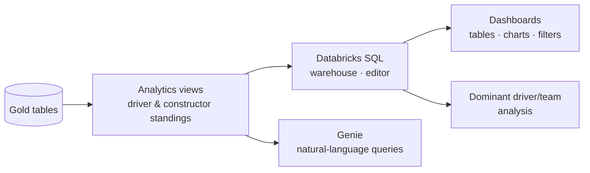

# Data Analytics — Section Overview

The data pipeline is essentially complete: raw data in **bronze**, cleaned data in
**silver**, and a curated **dimensional model** in **gold**. We now have clean,
reliable, analytics-ready data — this is where analysts and business users start
exploring it to answer interesting questions.

## What we'll answer

- How did each **driver** perform during the championship in each season?
- How did each **constructor** perform across seasons?
- Which drivers have been the most **dominant** in Formula 1 history?
- Which constructors have achieved the greatest success?

## What this section covers

| Topic | Focus |
| --- | --- |
| **Analytics views** | Driver and constructor **standings** views on top of the gold tables. |
| **Databricks SQL** | SQL warehouses and the SQL Editor. |
| **Dashboards** | Build interactive dashboards (tables, bar/pie charts, filters). |
| **Dominant analysis** | A data-analyst's exploration of the greatest drivers and teams. |
| **Genie** | Querying data with natural language. |

These views summarize and organize the data to make it easy to query and visualize.
We then build interactive **dashboards** to explore driver and constructor performance
across seasons — turning the lakehouse pipeline's output into **insights**.

Let's start by creating the driver standings view.

## References

- [SQL warehouse types](https://learn.microsoft.com/en-us/azure/databricks/compute/sql-warehouse/warehouse-types)
- [Dashboard concepts](https://learn.microsoft.com/en-us/azure/databricks/dashboards/concepts)
- [What is a Genie space?](https://learn.microsoft.com/en-us/azure/databricks/genie/)
- [Spark SQL window functions](https://spark.apache.org/docs/latest/sql-ref-syntax-qry-select-window.html)
