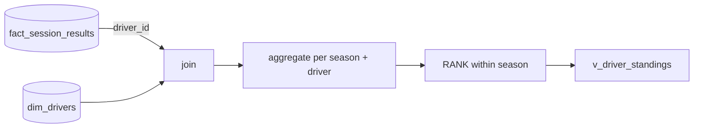

# Driver Standings View

This lesson builds an analytics view representing each driver's performance across
seasons — the **driver standings**.

## What are standings?

A driver's performance in a season is measured by total points scored across all
races. The driver with the most points is the **champion** (rank 1), the next is rank
2, and so on. Ties are broken by **number of wins** (then podiums).

The view should contain, **per season per driver**: driver name, nationality,
standing position, race starts, total points, number of wins, number of podiums.

## Sources



| Source | Provides |
| --- | --- |
| `fact_session_results` | Results — points, `is_win`, `is_podium` |
| `dim_drivers` | Driver name, nationality |

!!! tip "Why Spark SQL here?"
    The course switches to **Spark SQL** (not PySpark) for analytics — it's more
    interactive for iterative querying, and it's what most **data analysts** use.

## Aggregating the data

Join the fact and dimension on `driver_id` (inner join — only drivers with results),
then aggregate, grouping by season + driver:

```sql
SELECT
    r.season,
    d.driver_id,
    d.driver_name,
    d.nationality,
    COUNT(*)                AS race_starts,
    SUM(r.points)           AS total_points,
    COUNT_IF(r.is_win)      AS number_of_wins,
    COUNT_IF(r.is_podium)   AS number_of_podiums
FROM formula1.gold.fact_session_results r
INNER JOIN formula1.gold.dim_drivers d
    ON r.driver_id = d.driver_id
GROUP BY r.season, d.driver_id, d.driver_name, d.nationality;
```

| Column | Logic |
| --- | --- |
| `race_starts` | `COUNT(*)` — an entry exists per race the driver started |
| `total_points` | `SUM(points)` |
| `number_of_wins` | `COUNT_IF(is_win)` — counts rows where the boolean is true |
| `number_of_podiums` | `COUNT_IF(is_podium)` |

## Ranking with a window function and CTE

The standing position uses the `RANK()` window function, partitioned by season,
ordered by points (then wins) descending. Since you **can't use aggregates inside
`OVER`**, wrap the aggregation in a **CTE** (`WITH`):

```sql
CREATE OR REPLACE VIEW formula1.gold.v_driver_standings AS
WITH driver_session_summary AS (
    SELECT
        r.season,
        d.driver_id,
        d.driver_name,
        d.nationality,
        COUNT(*)              AS race_starts,
        SUM(r.points)         AS total_points,
        COUNT_IF(r.is_win)    AS number_of_wins,
        COUNT_IF(r.is_podium) AS number_of_podiums
    FROM formula1.gold.fact_session_results r
    INNER JOIN formula1.gold.dim_drivers d
        ON r.driver_id = d.driver_id
    GROUP BY r.season, d.driver_id, d.driver_name, d.nationality
)
SELECT
    *,
    RANK() OVER (
        PARTITION BY season
        ORDER BY total_points DESC, number_of_wins DESC
    ) AS standing
FROM driver_session_summary;
```

!!! note "Why a view (not a table)?"
    A **view** keeps logic centralized — change it once and all dashboards follow. For
    large data you might **materialize** a table for faster dashboards, but here the
    data is small, so a view is ideal. (Naming: the course prefixes views with `v_`.)

Filtering the view to a season (e.g. 2025) and ordering by points matches the official
F1 standings — e.g. Lando Norris champion with 423 points.

## What's next

Next we build the equivalent constructor standings view. Continue to
[Constructor Standings View](03_constructor-standings-view.md).

## References

- [SQL warehouse types](https://learn.microsoft.com/en-us/azure/databricks/compute/sql-warehouse/warehouse-types)
- [Dashboard concepts](https://learn.microsoft.com/en-us/azure/databricks/dashboards/concepts)
- [What is a Genie space?](https://learn.microsoft.com/en-us/azure/databricks/genie/)
- [Spark SQL window functions](https://spark.apache.org/docs/latest/sql-ref-syntax-qry-select-window.html)
