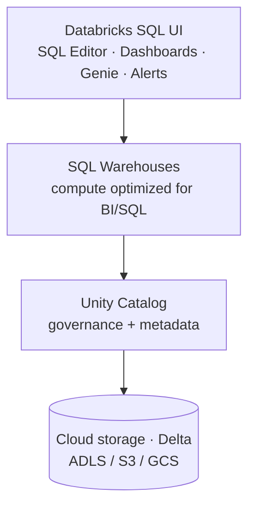

# Introduction to Databricks SQL

!!! note "It's not a SQL dialect"
    A common misconception: **Databricks SQL is not a type of SQL**. It's an
    **analytics and data visualization environment** on the lakehouse platform,
    delivering analytics and reporting using standard **ANSI SQL** over data stored in
    the lakehouse.

## Who uses it

| User | Role with Databricks SQL |
| --- | --- |
| **Data analysts / business users** | Primary users — query, ad-hoc analysis, visualization, dashboards. |
| **Data scientists** | Secondary — occasional ad-hoc analysis before moving to notebooks. |
| **Data engineers** | Occasional — provision compute, scheduling, alerting, security, performance tuning. |

Business users can also use dashboards and **AI/BI Genie** (natural-language querying)
to extract insights.

## Architecture

- Data lives in **cloud object storage** in **Delta** format; **Unity Catalog**
  provides metadata and governance.
- **SQL warehouses** provide compute optimized for BI/SQL workloads. Like standard
  clusters, they can be **serverless** (runs in the Databricks subscription, ready in
  seconds) or **provisioned** (runs in your subscription, ~4 minutes to start).

## Key UI components

All grouped under the **SQL** menu in the sidebar:

| Component | Purpose |
| --- | --- |
| **SQL Editor** | Write and run SQL queries interactively; save queries. |
| **Dashboards** | Create and organize visualizations and reports; publish/share. |
| **Genie** | Query data with natural language via generative AI. |
| **Alerts** | Notify users when query results meet conditions. |
| **Query History** | Details of previously executed queries; replay them. |
| **SQL Warehouses** | Create/manage the compute engine for SQL. |

## Summary

Databricks SQL brings **data-warehousing capabilities to the lakehouse** — BI-optimized
compute plus interactive querying and dashboarding. Next we create a SQL warehouse.

## What's next

Continue to [SQL Warehouses](05_sql-warehouse.md).

## References

- [SQL warehouse types](https://learn.microsoft.com/en-us/azure/databricks/compute/sql-warehouse/warehouse-types)
- [Dashboard concepts](https://learn.microsoft.com/en-us/azure/databricks/dashboards/concepts)
- [What is a Genie space?](https://learn.microsoft.com/en-us/azure/databricks/genie/)
- [Spark SQL window functions](https://spark.apache.org/docs/latest/sql-ref-syntax-qry-select-window.html)
