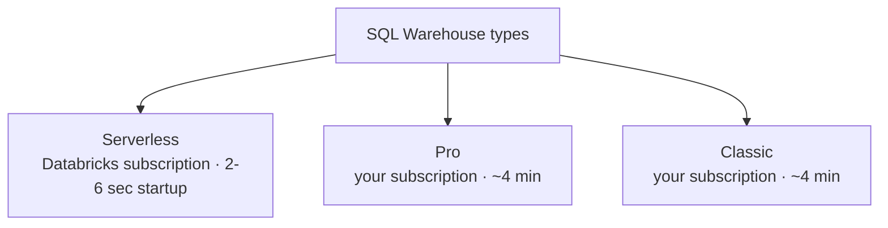

# SQL Warehouses

A **SQL warehouse** is the compute engine for Databricks SQL. This lesson creates and
configures one (**SQL Warehouses → Create SQL warehouse**).

## Warehouse types

| Type | Runs in | Startup | Performance features |
| --- | --- | --- | --- |
| **Serverless** | Databricks subscription | 2–6 seconds | Photon + Predictive I/O + Intelligent Workload Management (most performant) |
| **Pro** | Your subscription | ~4 minutes | Photon + Predictive I/O |
| **Classic** | Your subscription | ~4 minutes | Photon (least performant) |

All three use **Photon** by default. Pro/Serverless cost slightly more due to the extra
optimizations.

!!! note "Serverless may be unavailable"
    Serverless isn't available in all regions or subscriptions yet — don't worry if you
    don't see it. The course uses **Classic** (we don't need much performance). If you
    only have serverless, use it — and keep the size at **2X-Small** to control cost.

## Configuration

| Setting | Value / notes |
| --- | --- |
| **Name** | e.g. `DEA Course Warehouse` |
| **Cluster size** | **2X-Small** (T-shirt sizes map to worker nodes: 2X-Small = 1 worker, X-Small = 2, Small = 4, … up to 256). Default X-Large is overkill. |
| **Auto stop** | **20 minutes** — stops after inactivity to avoid charges. |
| **Scaling (min/max clusters)** | Default 1/1. Increase **max** for more concurrent users (Databricks suggests ~1 cluster per 10 concurrent queries). More clusters = more DBUs. |

!!! warning "Quota errors"
    A Classic 2X-Small needs vCPUs in a VM family (e.g. **Ev3**). If you exceed your
    cloud quota you'll see a warning — request more quota via **Azure → Quotas →
    Compute** (filter by region/family), or use **serverless** (which doesn't check
    your quota). On a free subscription that can't raise quota, you can just watch the
    next few lessons.

## Advanced options

| Option | Notes |
| --- | --- |
| **Tags** | For billing/allocation. |
| **Unity Catalog** | Keep enabled (disabling uses Hive Metastore). |
| **Spot instance policy** | **Cost optimized** (use spot when available) vs **Reliability optimized** (always provisioned VMs). Cost optimized is fine here. |
| **Channel** | **Current** (vs Preview for preview features). |

## Managing the warehouse

After **Create**, the warehouse is provisioned. From its page you can get **connection
details** (for Power BI, Tableau, etc.), monitor status/history/metrics, **edit** the
warehouse (some changes need a restart), assign permissions, and **Stop** it (no
charges once stopped). Auto-stop will stop it after 20 idle minutes regardless.

## What's next

Next we use the warehouse from the SQL Editor. Continue to [SQL Editor](06_sql-editor.md).

## References

- [SQL warehouse types](https://learn.microsoft.com/en-us/azure/databricks/compute/sql-warehouse/warehouse-types)
- [Dashboard concepts](https://learn.microsoft.com/en-us/azure/databricks/dashboards/concepts)
- [What is a Genie space?](https://learn.microsoft.com/en-us/azure/databricks/genie/)
- [Spark SQL window functions](https://spark.apache.org/docs/latest/sql-ref-syntax-qry-select-window.html)
- [Enable serverless SQL warehouses](https://learn.microsoft.com/en-us/azure/databricks/compute/sql-warehouse/serverless)
