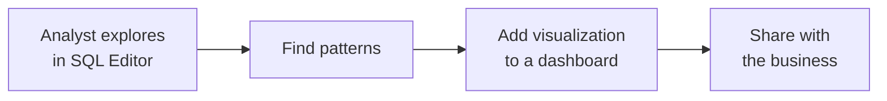

# SQL Editor

The **SQL Editor** is an interface designed specifically for writing and running SQL
queries. Unlike notebooks, it **only supports SQL** (no Python/Scala) — it's commonly
used by analysts for exploring data and creating analytical datasets.

!!! note "SQL Editor vs notebooks"
    Data **engineers** prefer **notebooks** (multiple languages, documentation,
    mixing). Data **analysts** prefer the **SQL Editor** (simpler, SQL-focused). You
    *can* create views/tables from either — the course built the standings views in
    notebooks, but they could equally be created here.

## Running queries

1. **SQL Editor → SQL Query** creates a new query.
2. Attach it to a **SQL warehouse** (Start and attach).
3. Write SQL and **Run** (browse the catalog to insert names):

```sql
SELECT * FROM formula1.gold.v_driver_standings
WHERE season = 2025;
```

!!! tip "The 1000-row limit"
    The run button shows `(1000)` — output is limited to 1000 rows by default. Untick
    it to return all rows. With multiple statements you can run a selected one or run
    all.

You can write any SQL here — filters, joins, even `CREATE VIEW`/`CREATE TABLE` — doing
everything you'd do in a notebook with SQL.

## Visualizations

The editor can also **visualize** query results. Click **+** to add a visualization —
e.g. compare two drivers over time:

```sql
SELECT season, driver_name, standing
FROM formula1.gold.v_driver_standings
WHERE driver_name IN ('Max Verstappen', 'Lewis Hamilton')
  AND season > 2014
ORDER BY season;
```

A **line chart** with `season` on the X-axis, `standing` on the Y-axis, grouped by
`driver_name`, plots each driver's finishing position over the years.

## Saving and dashboards

Save the query (e.g. to the project's `analytics` folder, renamed meaningfully). You
can also add a visualization to a dashboard via **Add to dashboard → create new**.



!!! tip "Two workflows"
    - **Explore-first:** an analyst browses in the SQL Editor, finds something useful,
      then adds it to a dashboard (the workflow above).
    - **Requirements-known:** if you already know what's needed, go straight to
      **Dashboards** and build there — which is what the next lesson does.

## What's next

Next we build a proper dashboard for the driver standings. Continue to
[Driver Standings Dashboard](07_driver-standings-dashboard.md).

## References

- [SQL warehouse types](https://learn.microsoft.com/en-us/azure/databricks/compute/sql-warehouse/warehouse-types)
- [Dashboard concepts](https://learn.microsoft.com/en-us/azure/databricks/dashboards/concepts)
- [What is a Genie space?](https://learn.microsoft.com/en-us/azure/databricks/genie/)
- [Spark SQL window functions](https://spark.apache.org/docs/latest/sql-ref-syntax-qry-select-window.html)
