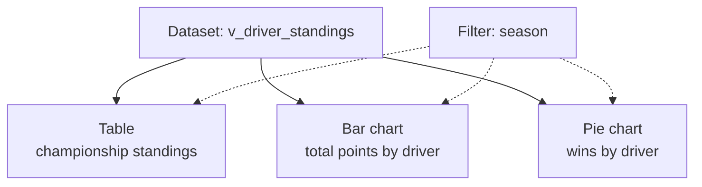

# Driver Standings Dashboard

This lesson builds a dashboard from the driver standings view, with multiple
visualizations and a filter.

## Creating the dashboard & data source

**Create dashboard**, name it (e.g. *Formula 1 Analytics Dashboard*). A dashboard has
two parts: **Data** (left) and the **canvas**. Add a data source three ways:

| Option | When to use |
| --- | --- |
| **From SQL** | Paste a `SELECT`; the result becomes the dataset. |
| **From Unity Catalog** | Pick an existing table/view (e.g. `formula1.gold.v_driver_standings`). |
| **Upload a file** | Quick testing with a small reference file. |

!!! tip "Prefer a view as the source"
    Use the **view** (`v_driver_standings`) rather than an inline `SELECT` — change the
    view once and all dashboards follow, no per-dashboard edits.

## Building the visualizations

Rename the page (e.g. *Driver Championship Standings*) and add a title via a **text
box** (Heading 1). The bottom toolbar adds visualizations, text boxes, and filters.

### Table

Add a **table** visualization, choose the dataset, and add columns (standing, driver
name, nationality, points, wins, season). For each column you can set a **display
name**, **alignment**, and **custom number format** (e.g. show decimals only when
present, so `25` not `25.00`). Reorder columns by dragging.

### Filter

Add a **filter**, title it *Season*, set type to **single value**, field = `season`,
default = `2025`, and order the values **descending** so recent seasons appear first.
The filter applies to the visualizations on the page.

### Bar chart — total points by driver

Add a **bar chart**: X = `total_points`, Y = `driver_name`, aggregation = **None**
(data is pre-aggregated in the view). Polish it:

- **Sort by field** (total points) so it's ordered by value, not alphabetically.
- **Color** by total points (e.g. the *plasma* color ramp).
- Turn on **labels** to show exact point values.

### Pie chart — wins by driver

Add a **pie chart**: angle = `number_of_wins`, color by `driver_name`, and turn on
**labels** to show each driver's share (e.g. Verstappen 33.33%).

## Analyzing with the dashboard

With the filter you can switch seasons and immediately see dominance — e.g. 2020 shows
Hamilton with ~64.7% of wins, 2023 shows Verstappen with ~82% (23 wins). Visuals make
dominance far clearer than a table.

## What's next

Next, the equivalent constructor dashboard. Continue to
[Constructor Standings Dashboard](08_constructor-standings-dashboard.md).

## References

- [SQL warehouse types](https://learn.microsoft.com/en-us/azure/databricks/compute/sql-warehouse/warehouse-types)
- [Dashboard concepts](https://learn.microsoft.com/en-us/azure/databricks/dashboards/concepts)
- [What is a Genie space?](https://learn.microsoft.com/en-us/azure/databricks/genie/)
- [Spark SQL window functions](https://spark.apache.org/docs/latest/sql-ref-syntax-qry-select-window.html)
