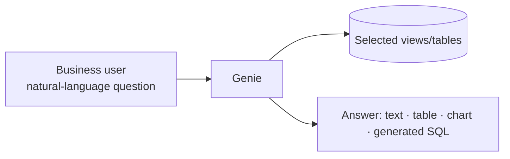

# AI/BI Genie

**Databricks Genie** lets you interact with your data using **natural language** — no
SQL or Python required. It's mainly targeted at **business users** (access it via
**SQL → Genie**).

!!! warning "Requires Pro or Serverless"
    Genie needs a SQL warehouse on the **Pro** or **Serverless** tier — **Classic
    won't work**. (Pro/Serverless cost more, so switch back when done.)

## Creating a Genie space

**New → select the tables** Genie can work with — e.g. the two views
`v_driver_standings` and `v_constructor_standings` from the gold schema — then
**Create**. Rename the space (e.g. *Formula 1 Data Analysis*).

## Asking questions

Ask plain-English questions; Genie figures out the relevant tables and writes the SQL.
For example:

- *"What are the tables in this space, and how are they related? Give me a short
  summary."*
- *"Who are the top five drivers within the latest season?"*

For the second, Genie correctly picks `v_driver_standings`, works out the latest
season, and returns the answer as **text, a table, and a visualization**.

!!! tip "Show the generated code"
    Click **Show code** to see the SQL Genie wrote — often sophisticated (e.g. a CTE
    to find `MAX(season)` plus a `RANK()` filtered to `rnk <= 5`). You can edit it, or
    copy it into the SQL Editor / a dashboard.

You can also ask for specific visuals (*"visualize this as a pie chart"*) and **edit**
the result (e.g. rename `total_points` → `points`).

## Who uses what

| User | Typical tool |
| --- | --- |
| **Business user** | Stays in **Genie** (natural language). |
| **Data analyst** | Starts in the **SQL Editor** (which also has AI assistance). |

Genie spaces can be **shared** with colleagues for collaboration.

## Section complete

This concludes the Data Analytics section — from analytics views, through Databricks
SQL warehouses, the SQL Editor, dashboards, and dominant-performer analysis, to
natural-language querying with Genie. The Formula 1 lakehouse is now a complete
analytical solution.

## References

- [SQL warehouse types](https://learn.microsoft.com/en-us/azure/databricks/compute/sql-warehouse/warehouse-types)
- [Dashboard concepts](https://learn.microsoft.com/en-us/azure/databricks/dashboards/concepts)
- [What is a Genie space?](https://learn.microsoft.com/en-us/azure/databricks/genie/)
- [Spark SQL window functions](https://spark.apache.org/docs/latest/sql-ref-syntax-qry-select-window.html)
