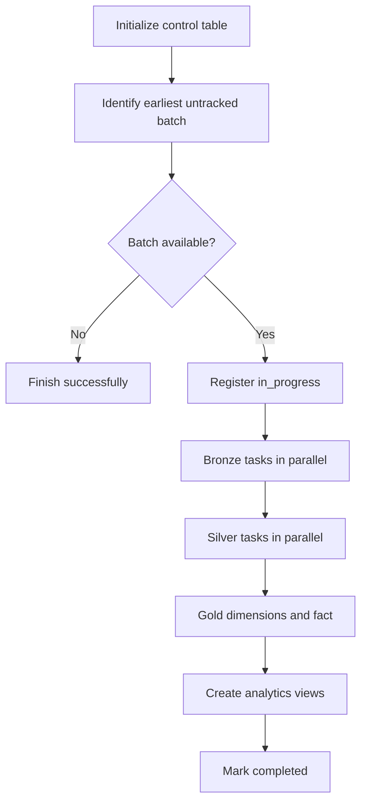

# Incremental Data Processing

The incremental pipeline processes one landing batch per Lakeflow Job run. It
uses the same Bronze, Silver, and Gold model as the full-refresh pipeline, but
replaces table overwrites with Delta `MERGE` operations keyed by each dataset's
business key.

The job has `max_concurrent_runs: 1`. This matters because batch discovery and
claiming are separate tasks; serial job runs prevent two workers from selecting
the same untracked folder concurrently.

## Control table

`<catalog>.control.batch_control` records the batch identifier, status, and
timestamps. A batch moves through two states:

| State | Meaning |
| --- | --- |
| `in_progress` | The job claimed the batch and processing has started. |
| `completed` | Every data and analytics task finished successfully. |

The claim task uses an insert-only Delta `MERGE`, so a task retry cannot append
a duplicate control row. The completion task only updates an existing
`in_progress` row.

## Source code

The incremental pipeline is the Python package `src/formula1_lakehouse`, run by
the job defined in `resources/incremental.job.yml`. The resource file is the
source of truth for task dependencies and parameter wiring; the package modules
hold the transformations and merge logic, and are covered by the tests in
`tests/`. See [The Production Python Package](../15_deployment/02_python-package.md).

The notebooks in `notebooks/05_formula1-project-incremental-load` are the
step-by-step, experimental version the package was derived from. They are no
longer part of the job.

