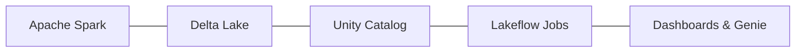

# Azure Databricks for Data Engineers

Welcome to the documentation for the **Azure Databricks for Data Engineers** course
- a hands-on, project-driven guide to building modern data engineering solutions on
the Databricks platform.

These docs are built from the course transcripts and structured for quick reference.
They cover everything from setting up Azure to understanding the Databricks
architecture, building towards an end-to-end **Formula 1 Data Lakehouse** project.

## What this course covers

You will work with **Apache Spark** (via PySpark and Spark SQL), **Delta Lake**,
**Unity Catalog**, **Lakeflow Jobs**, and **Databricks Dashboards** - applying the
**Medallion Architecture** (Bronze → Silver → Gold) to a real dataset.

## Documentation sections

- **[Introduction](01_introduction/01_intro.md)**

    ---

    Course overview, what you will build, and the recommended learning path.

- **[Azure Subscription](02_subscription/01_azure-account.md)**

    ---

    Create a free Azure account and get oriented in the Azure portal.

- **[Azure Databricks](03_databricks/01_intro.md)**

    ---

    Introduction to Databricks, creating a workspace, the workspace UI, and the
    platform architecture.

- **[Databricks Compute](04_databricks-compute/01_overview.md)**

    ---

    Compute types (Serverless vs Classic), configuration options, creating a
    cluster, and troubleshooting quota/VM issues.

- **[Databricks Notebooks](05_databricks-notebook/01_overview.md)**

    ---

    Working with notebooks, magic commands, Databricks Utilities (`dbutils`), and
    the interactive debugger.

- **[Unity Catalog](06_unity-catalog/01_intro.md)**

    ---

    Governance object model, metastores, and securely connecting to cloud storage
    with storage credentials and external locations.

- **[Formula 1 Project](07_project-overview/01_overview.md)**

    ---

    The project dataset, requirements, the data lakehouse and medallion concepts,
    and the end-to-end solution architecture.

- **[Project Setup](08_project-setup/01_overview.md)**

    ---

    Setting up the Azure Data Lake containers and the Unity Catalog catalog,
    schemas, and volume for the project.

- **[Delta Lake](09_delta-lake/01_delta-lake.md)**

    ---

    The storage layer behind the lakehouse: the transaction log, version history and
    time travel, and how ACID transactions work.

- **[Data Ingestion (Bronze)](10_data-ingestion-bronze/01_data-ingestion-overview.md)**

    ---

    Ingesting all six Formula 1 datasets into the bronze layer with PySpark -
    DataFrameReader/Writer, schemas, metadata, refactoring, and JSON variations.

- **[Data Transformation (Silver)](11_data-transformation-silver/01_overview.md)**

    ---

    Cleaning and standardizing the bronze data into silver - column selection,
    renaming, data-quality checks, flattening nested structs, and coding styles.
    Also covers orchestration with Lakeflow Jobs.

- **[Data Transformation (Gold)](12_data-transformation-gold/01_intro.md)**

    ---

    Dimensional modeling - building dimensions and a fact table (star schema), joins,
    integrating gold into the Lakeflow job, triggers, and notifications.

- **[Data Analytics](13_data-analytics/01_intro.md)**

    ---

    Analytics views, Databricks SQL warehouses and editor, building dashboards,
    dominant driver/team analysis, and natural-language queries with Genie.

- **[Incremental Processing](14_incremental-data-processing/01_overview.md)**

    ---

    Batch contracts, Delta merge strategy, task-value orchestration, recovery,
    and day-two operations.

- **[Bundle Deployment](15_deployment/01_asset-bundles.md)**

    ---

    Validate, deploy, and run the Databricks bundle across development and
    production targets.

!!! note "Coverage"
    This documentation covers the full pipeline build — from Azure setup and the
    Databricks platform through Unity Catalog, the Medallion layers (bronze → silver →
    gold), Lakeflow Jobs orchestration, and data analytics with dashboards and Genie.

## How to use these docs

Follow the sections **in order** - each builds on the previous one. Start with the
[Course Introduction](01_introduction/01_intro.md).

## References

- [Azure Databricks documentation](https://learn.microsoft.com/en-us/azure/databricks/)
- [What is a data lakehouse?](https://learn.microsoft.com/en-us/azure/databricks/lakehouse/)
- [What is the medallion lakehouse architecture?](https://learn.microsoft.com/en-us/azure/databricks/lakehouse/medallion)
