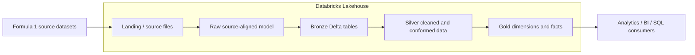

# 01 — Architecture Overview

## Goal

The project implements a Formula 1 analytical platform as a layered Lakehouse. The screenshots show a progression from source files through landing/raw-style storage, Bronze, Silver, and Gold structures, with Databricks and Unity Catalog used to organize the data products.

## High-level architecture

## Architectural responsibilities

| Stage | Main responsibility | Data shape |
| --- | --- | --- |
| Source/Landing | Retain delivered datasets | Files / source payloads |
| Raw | Preserve source semantics and relationships | Source-oriented entities |
| Bronze | Persist ingestible Delta representation and technical lineage | Near-source Delta tables |
| Silver | Clean, standardize, type, deduplicate and conform | Reusable domain tables |
| Gold | Serve analytics with dimensions, facts and business-friendly semantics | Dimensional model |

## Core domain

The raw source model contains six entities: `circuits`, `races`, `constructors`, `drivers`, `results`, and `sprints`. The first four provide reference/event context; the latter two carry measurable session outcomes.

## Why this structure matters

The architecture separates source fidelity from analytical usability. This prevents ingestion logic from silently rewriting source semantics while still allowing later layers to remove duplication, standardize fields and build a BI-oriented model.

Next: [02 — Lakehouse Layers](02_lakehouse_layers.md)
