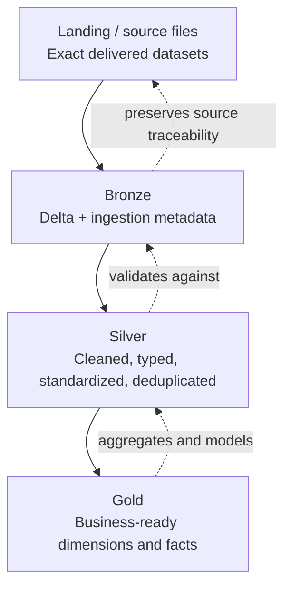
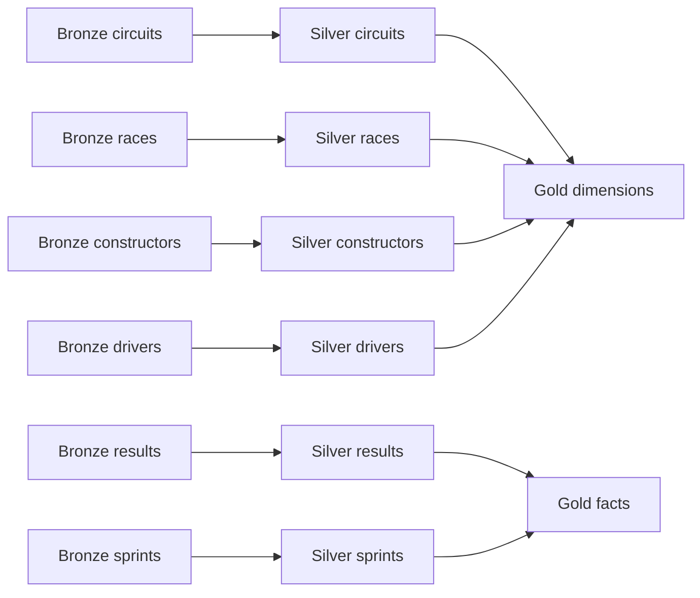

# 02 — Lakehouse Layers

The screenshots depict a classic layered Lakehouse progression. The following diagram expresses that structure explicitly.

## Landing and raw

Landing is the immutable or minimally touched delivery area. The raw model mirrors the Formula 1 source structure and therefore deliberately retains repeated race attributes and separate `results`/`sprints` datasets.

## Bronze

Bronze is the first managed Lakehouse representation. A practical implementation keeps the source columns intact while adding technical ingestion information such as load timestamps, source-file lineage or batch identifiers. The exact technical column names are implementation-specific and should match the physical catalog.

## Silver

Silver is where source irregularities are resolved. Typical responsibilities are:

- parse and enforce data types;
- standardize null handling;
- validate primary and foreign keys;
- remove duplicate deliveries;
- standardize names and dates;
- reconcile repeated `raceName`, `date`, and `url` values against the authoritative race entity;
- expose reusable domain tables.

## Gold

Gold transforms the conformed domain into analytics-ready structures. The screenshots indicate a dimensional/star-model direction, where descriptive entities become dimensions and measurable race/session outcomes become facts.

Next: [03 — Raw Model Overview](03_raw_model_overview.md)
