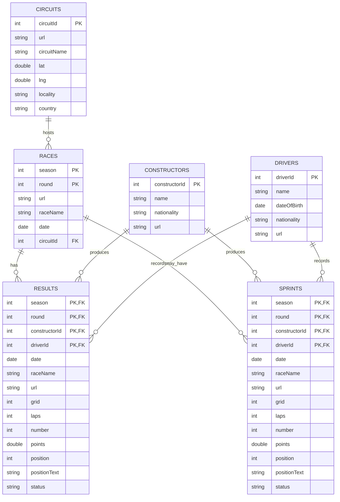
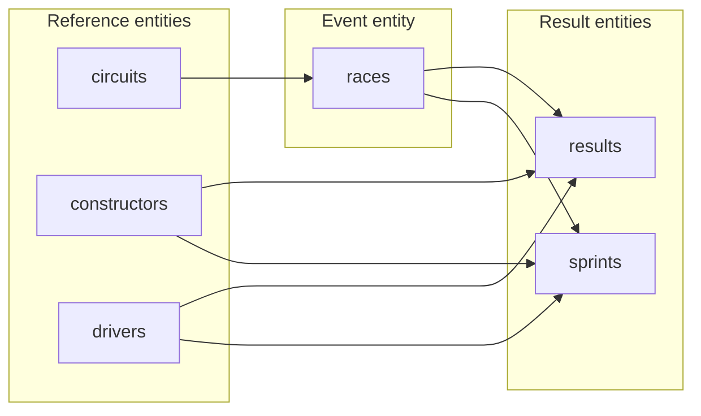

# 03 — Raw Model Overview

## 1. Purpose of the raw data model

The raw data model represents the Formula 1 datasets as they are received from the source system.

It contains six entities:

```text
circuits

races

constructors

drivers

results

sprints
```

The model is source-oriented. Therefore, it preserves:

* original column names such as `circuitId` and `raceName`;

* original URLs;

* repeated race information inside result datasets;

* separate tables for race results and sprint results;

* the original relationships between the source entities.

At this stage, the objective is not to create an optimized analytical model. The objective is to store the source data accurately and preserve its original structure.

---

## 2. Understanding the ERD notation

The diagram uses the following abbreviations:

| Abbreviation        | Meaning                                                  |
| ------------------- | -------------------------------------------------------- |
| `PK`                | Primary key                                              |
| `FK1`, `FK2`, `FK3` | Foreign-key relationship                                 |
| `PK, FK1`           | Column is part of the primary key and also a foreign key |
| Underlined column   | Key column                                               |

A primary key uniquely identifies a record.

A foreign key connects a record to another entity.

For example:

```text
races.circuitId → circuits.circuitId
```

This means that every race references a circuit.

---

## 3. Entity overview

The model can be divided into three logical areas.

### 3.1 Reference entities

These entities describe relatively stable objects:

```text
circuits

constructors

drivers
```

### 3.2 Event entity

The `races` entity describes a race event in a specific season and round.

```text
races
```

### 3.3 Result entities

These entities contain the performance of drivers and constructors during race sessions:

```text
results

sprints
```

---

## Complete raw ERD



## Domain grouping



Next: [04 — Raw Reference Entities](04_raw_reference_entities.md)
