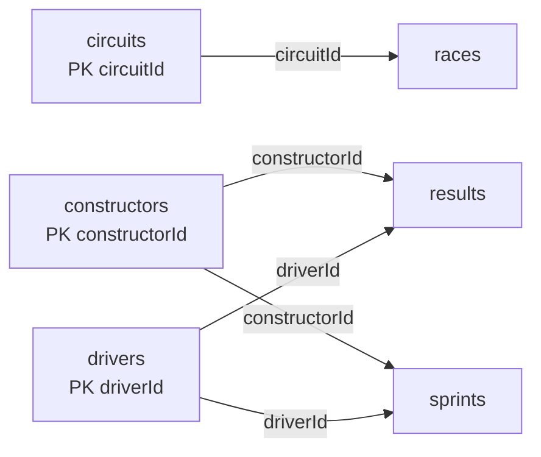

# 04 — Raw Reference Entities

The source model contains three descriptive reference entities: circuits, constructors and drivers. They are modeled separately so that event and performance records reference stable identifiers instead of duplicating the complete descriptive payload.

## 4. Step 1: `circuits` entity

### 4.1 Purpose

The `circuits` table stores information about Formula 1 racing circuits.

Examples include:

* Silverstone Circuit;

* Monza;

* Monaco;

* Spa-Francorchamps;

* Suzuka.

### 4.2 Grain

One row represents one circuit.

The grain can be expressed as:

> One record per Formula 1 circuit.

### 4.3 Primary key

```text
circuitId
```

`circuitId` uniquely identifies a circuit.

Example:

| circuitId | circuitName                    |
| --------: | ------------------------------ |
|         1 | Albert Park Grand Prix Circuit |
|         9 | Silverstone Circuit            |
|        14 | Autodromo Nazionale di Monza   |

### 4.4 Columns

| Column        | Description                                          |
| ------------- | ---------------------------------------------------- |
| `circuitId`   | Unique circuit identifier                            |
| `url`         | Source URL containing additional circuit information |
| `circuitName` | Name of the circuit                                  |
| `lat`         | Latitude                                             |
| `lng`         | Longitude                                            |
| `locality`    | City or local area                                   |
| `country`     | Country in which the circuit is located              |

The image may visually resemble `Ing`, but the intended field is normally `lng`, meaning longitude.

### 4.5 Relationship

The circuit is referenced by the `races` table:

```text
circuits.circuitId

        ↓

races.circuitId
```

The relationship is:

```text
One circuit → many races
```

A circuit may host races across several seasons.

For example, Silverstone may appear in:

```text
2023 round 10

2024 round 12

2025 round 11
```

All these race records can reference the same `circuitId`.

---

## 6. Step 3: `constructors` entity

### 6.1 Purpose

The `constructors` table stores Formula 1 teams or constructors.

Examples include:

* Ferrari;

* Mercedes;

* McLaren;

* Red Bull Racing;

* Aston Martin.

### 6.2 Grain

One row represents one constructor.

The grain is:

> One record per Formula 1 constructor.

### 6.3 Primary key

```text
constructorId
```

This uniquely identifies the constructor.

Example:

| constructorId | name     |
| ------------- | -------- |
| 1             | McLaren  |
| 6             | Ferrari  |
| 9             | Red Bull |

### 6.4 Columns

| Column          | Description                                        |
| --------------- | -------------------------------------------------- |
| `constructorId` | Unique constructor identifier                      |
| `name`          | Constructor or team name                           |
| `nationality`   | Nationality associated with the constructor        |
| `url`           | Source URL with additional constructor information |

### 6.5 Relationships

The constructor is referenced by both `results` and `sprints`.

```text
constructors.constructorId

        ↓

results.constructorId
```

```text
constructors.constructorId

        ↓

sprints.constructorId
```

The relationships are:

```text
One constructor → many race results

One constructor → many sprint results
```

A constructor can participate in many rounds, seasons, and session types.

---

## 7. Step 4: `drivers` entity

### 7.1 Purpose

The `drivers` table stores information about Formula 1 drivers.

### 7.2 Grain

One row represents one driver.

The grain is:

> One record per Formula 1 driver.

### 7.3 Primary key

```text
driverId
```

This uniquely identifies the driver.

Example:

| driverId | name           |
| -------- | -------------- |
| 1        | Lewis Hamilton |
| 4        | Lando Norris   |
| 830      | Max Verstappen |

### 7.4 Columns

| Column        | Description                                         |
| ------------- | --------------------------------------------------- |
| `driverId`    | Unique driver identifier                            |
| `name`        | Driver name                                         |
| `dateOfBirth` | Driver date of birth                                |
| `nationality` | Driver nationality                                  |
| `url`         | Source URL containing additional driver information |

### 7.5 Relationships

The driver is referenced by both result tables:

```text
drivers.driverId

        ↓

results.driverId
```

```text
drivers.driverId

        ↓

sprints.driverId
```

The relationships are:

```text
One driver → many race results

One driver → many sprint results
```

A driver can participate in multiple rounds and seasons.

---

## Reference-entity relationship summary



Next: [05 — Raw Race Entity](05_raw_race_entity.md)
