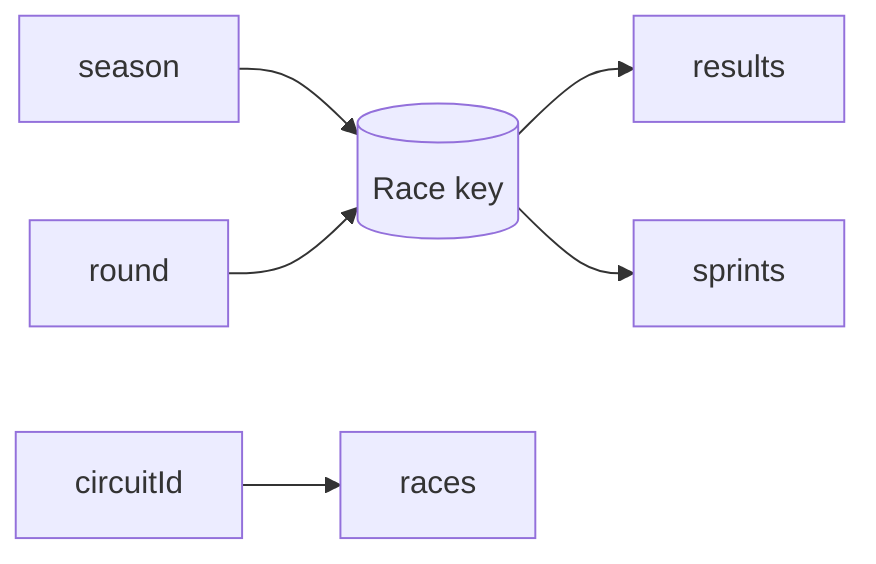
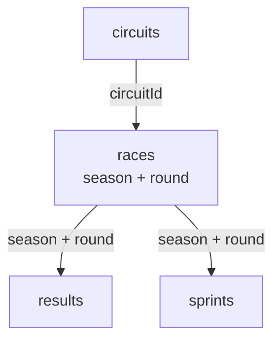

# 05 — Raw Race Entity

## 5. Step 2: `races` entity

### 5.1 Purpose

The `races` table stores information about race events.

A race is identified by its season and its round within that season.

Examples:

```text
2025 season, round 1

2025 season, round 2

2026 season, round 1
```

### 5.2 Grain

One row represents one Formula 1 race weekend or race event in a specific season and round.

The grain is:

> One record per season and round.

### 5.3 Composite primary key

The primary key consists of two columns:

```text
season

round
```

Neither column is sufficient by itself.

#### Why `season` alone is insufficient

A season contains multiple rounds.

```text
2025 round 1

2025 round 2

2025 round 3
```

#### Why `round` alone is insufficient

Round numbers are repeated every season.

```text
2024 round 1

2025 round 1

2026 round 1
```

Therefore, the unique race identifier is:

```text
season + round
```

Example:

| season | round | raceName              |
| -----: | ----: | --------------------- |
|   2025 |     1 | Australian Grand Prix |
|   2025 |     2 | Chinese Grand Prix    |
|   2026 |     1 | Australian Grand Prix |

### 5.4 Columns

| Column      | Description                           |
| ----------- | ------------------------------------- |
| `season`    | Formula 1 championship season         |
| `round`     | Round number within the season        |
| `url`       | Source URL for the race               |
| `raceName`  | Name of the race                      |
| `date`      | Race date                             |
| `circuitId` | Circuit at which the race takes place |

### 5.5 Foreign key

```text
circuitId
```

The relationship is:

```text
races.circuitId → circuits.circuitId
```

This means that every race must refer to a circuit.

### 5.6 Relationships to result tables

The composite race key is referenced by both result entities:

```text
races.season → results.season

races.round  → results.round
```

and:

```text
races.season → sprints.season

races.round  → sprints.round
```

The relationships are:

```text
One race → many race results

One race → many sprint results
```

A single race weekend can contain results for many drivers.

---

## Race identity

The race entity uses a composite key `(season, round)`. This is an important modeling choice because neither `season` nor `round` is globally unique by itself.



## Event-centered view



Next: [06 — Raw Result Entities](06_raw_result_entities.md)
