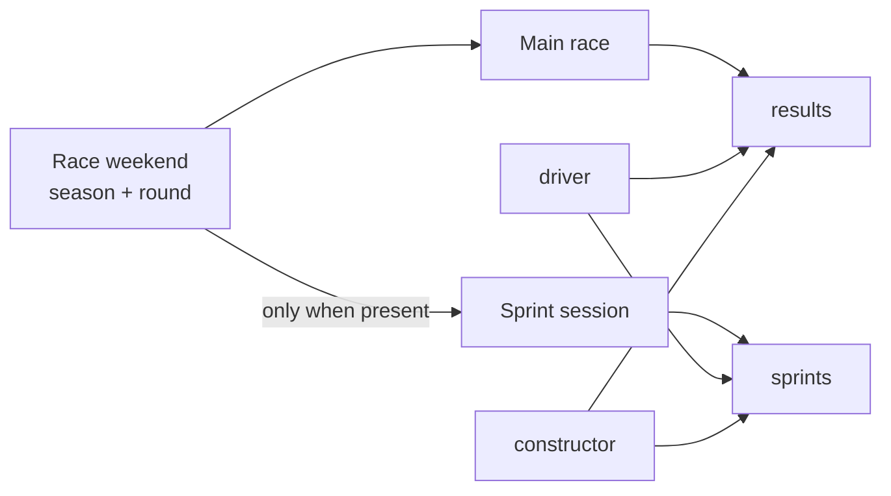

# 06 — Raw Result Entities

## 8. Step 5: `results` entity

### 8.1 Purpose

The `results` table stores the final results of the main race session.

It connects:

* a race;

* a driver;

* a constructor;

* the driver’s performance in that race.

### 8.2 Grain

One row represents:

> The race result of one driver, for one constructor, in one season and round.

An example record may mean:

> Driver 44 drove for constructor 131 in round 5 of the 2025 season.

### 8.3 Composite primary key

The primary key consists of four columns:

```text
season

round

constructorId

driverId
```

All four columns together identify one result record.

The key can be understood as:

```text
Race + constructor + driver
```

Example:

| season | round | constructorId | driverId |
| -----: | ----: | ------------: | -------: |
|   2025 |     1 |             1 |        4 |
|   2025 |     1 |             6 |       16 |
|   2025 |     1 |             9 |      830 |

### 8.4 Key columns and relationships

#### Race key

```text
season

round
```

These columns reference the `races` table:

```text
results.season → races.season

results.round  → races.round
```

#### Constructor key

```text
constructorId
```

This references:

```text
results.constructorId

    →

constructors.constructorId
```

#### Driver key

```text
driverId
```

This references:

```text
results.driverId

    →

drivers.driverId
```

### 8.5 Columns

| Column          | Description                                  |
| --------------- | -------------------------------------------- |
| `season`        | Season of the race                           |
| `round`         | Round within the season                      |
| `constructorId` | Constructor used by the driver               |
| `driverId`      | Driver who produced the result               |
| `date`          | Race date                                    |
| `raceName`      | Race name                                    |
| `url`           | Source URL                                   |
| `grid`          | Starting grid position                       |
| `laps`          | Number of completed laps                     |
| `number`        | Car number                                   |
| `points`        | Points awarded                               |
| `position`      | Numeric final position                       |
| `positionText`  | Textual representation of the final position |
| `status`        | Completion or retirement status              |

### 8.6 Example

| Column          | Example             |
| --------------- | ------------------- |
| `season`        | 2025                |
| `round`         | 3                   |
| `constructorId` | 6                   |
| `driverId`      | 16                  |
| `raceName`      | Japanese Grand Prix |
| `grid`          | 4                   |
| `laps`          | 53                  |
| `number`        | 16                  |
| `points`        | 15                  |
| `position`      | 3                   |
| `positionText`  | `3`                 |
| `status`        | Finished            |

This record describes one driver’s result in the main race.

---

## 9. Step 6: `sprints` entity

### 9.1 Purpose

The `sprints` table stores the result of the sprint session.

A sprint is different from the main race, but its structure is similar.

It contains:

* race information;

* driver information;

* constructor information;

* sprint starting position;

* sprint finishing position;

* sprint points.

### 9.2 Grain

One row represents:

> The sprint result of one driver, for one constructor, in one season and round.

### 9.3 Composite primary key

The primary key is:

```text
season

round

constructorId

driverId
```

This is the same key structure as the `results` table.

The records remain unique because race results and sprint results are stored in separate tables.

### 9.4 Foreign keys

#### Race relationship

```text
sprints.season → races.season

sprints.round  → races.round
```

#### Constructor relationship

```text
sprints.constructorId

    →

constructors.constructorId
```

#### Driver relationship

```text
sprints.driverId

    →

drivers.driverId
```

### 9.5 Columns

| Column          | Description                        |
| --------------- | ---------------------------------- |
| `season`        | Season containing the sprint       |
| `round`         | Round containing the sprint        |
| `constructorId` | Driver’s constructor               |
| `driverId`      | Driver participating in the sprint |
| `date`          | Session or race-weekend date       |
| `raceName`      | Race weekend name                  |
| `url`           | Source URL                         |
| `grid`          | Sprint starting position           |
| `laps`          | Completed sprint laps              |
| `number`        | Car number                         |
| `points`        | Sprint points                      |
| `position`      | Numeric finishing position         |
| `positionText`  | Textual finishing position         |
| `status`        | Sprint completion status           |

---

## Race versus sprint



Both result entities deliberately use the same composite identity shape while remaining separate source datasets.

Next: [07 — Relationships and Integrity](07_relationships_and_integrity.md)
