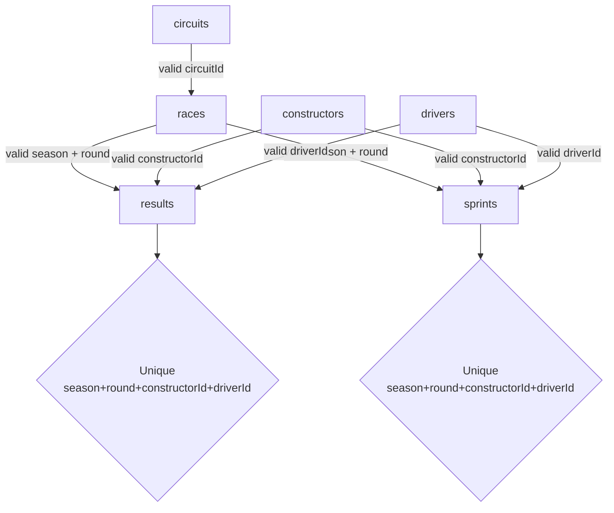

# 07 — Relationships and Integrity

## 10. Step-by-step relationship flow

### 10.1 Circuit to race

The first relationship is:

```text
circuits

   │

   └── circuitId

          ↓

      races.circuitId
```

Interpretation:

> A race takes place at one circuit, while a circuit may host many races.

Cardinality:

```text
circuits 1 ─── N races
```

---

### 10.2 Race to race results

The next relationship is:

```text
races

  ├── season

  └── round

       ↓

results

  ├── season

  └── round
```

Interpretation:

> One race can have many driver results.

Cardinality:

```text
races 1 ─── N results
```

---

### 10.3 Race to sprint results

The same race may also have a sprint session:

```text
races

  ├── season

  └── round

       ↓

sprints

  ├── season

  └── round
```

Cardinality:

```text
races 1 ─── N sprints
```

Not every race weekend necessarily contains sprint data.

Therefore, from a business perspective, the relationship can be interpreted as:

```text
One race → zero or many sprint-result records
```

---

### 10.4 Constructor to results

```text
constructors.constructorId

        ↓

results.constructorId
```

Interpretation:

> One constructor can produce many race-result records.

```text
constructors 1 ─── N results
```

---

### 10.5 Constructor to sprints

```text
constructors.constructorId

        ↓

sprints.constructorId
```

Interpretation:

> One constructor can produce many sprint-result records.

```text
constructors 1 ─── N sprints
```

---

### 10.6 Driver to results

```text
drivers.driverId

       ↓

results.driverId
```

Interpretation:

> One driver can have many race results across different rounds and seasons.

```text
drivers 1 ─── N results
```

---

### 10.7 Driver to sprints

```text
drivers.driverId

       ↓

sprints.driverId
```

Interpretation:

> One driver can have many sprint results.

```text
drivers 1 ─── N sprints
```

---

## 11. Complete logical relationship map

```text
circuits

    │

    │ circuitId

    ▼

races

    │

    │ season + round

    ├───────────────────────┐

    ▼                       ▼

results                  sprints

    ▲                       ▲

    │                       │

    ├──── constructors ─────┤

    │                       │

    └──────── drivers ──────┘
```

More explicitly:

```text
circuits.circuitId

    → races.circuitId

races.(season, round)

    → results.(season, round)

races.(season, round)

    → sprints.(season, round)

constructors.constructorId

    → results.constructorId

constructors.constructorId

    → sprints.constructorId

drivers.driverId

    → results.driverId

drivers.driverId

    → sprints.driverId
```

---

## 13. Data-integrity rules

The ERD implies several important rules.

### 13.1 Circuit references must be valid

Every `races.circuitId` should exist in `circuits`.

Invalid example:

```text
races.circuitId = 999
```

when no circuit with ID `999` exists.

---

### 13.2 Race references must be valid

Every combination of `season` and `round` in `results` or `sprints` should exist in `races`.

Invalid example:

```text
results:

season = 2025

round  = 30
```

when season 2025 has no round 30 in the `races` table.

---

### 13.3 Constructor references must be valid

Every `constructorId` in `results` and `sprints` should exist in `constructors`.

---

### 13.4 Driver references must be valid

Every `driverId` in `results` and `sprints` should exist in `drivers`.

---

### 13.5 Result records must be unique

The following combination should occur only once in `results`:

```text
season

round

constructorId

driverId
```

The same rule applies separately to `sprints`.

---

## Integrity dependency graph



## Recommended validation order

1. Validate uniqueness of reference keys.
2. Validate `(season, round)` uniqueness in `races`.
3. Validate circuit references from `races`.
4. Validate race, constructor and driver references in `results`.
5. Apply the same checks to `sprints`.
6. Validate result-key uniqueness separately in both session tables.

Next: [08 — Bronze to Silver](08_bronze_to_silver.md)
