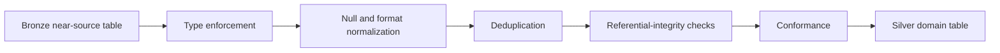
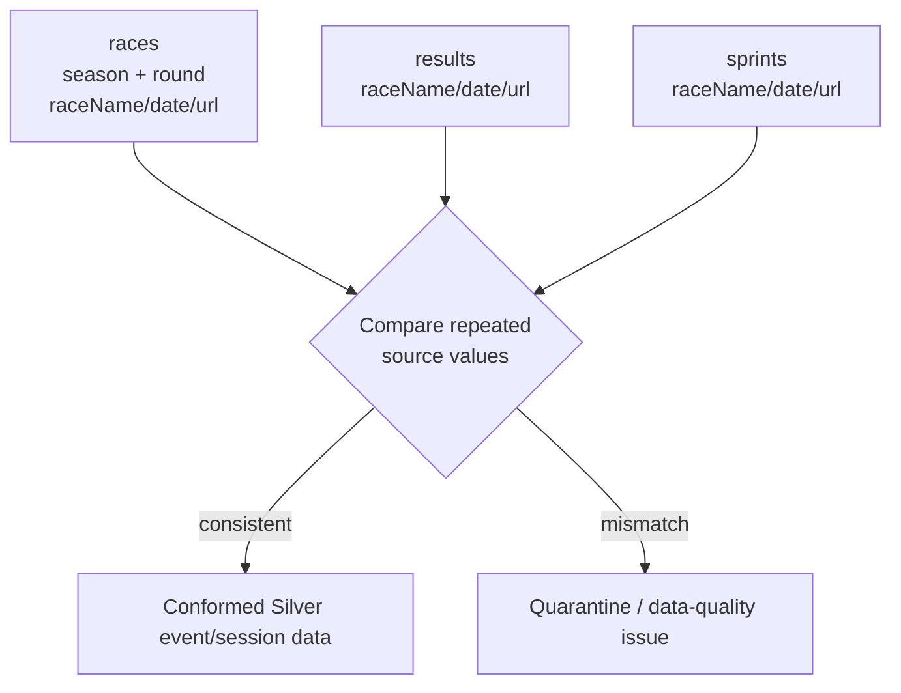
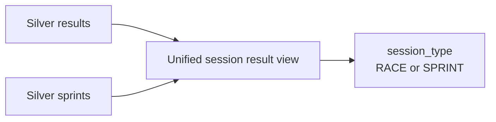

# 08 — Bronze-to-Silver Transformation

The screenshots extend the raw ERD into a Lakehouse pipeline. The raw model should not be confused with the Silver model: source duplication is acceptable in raw/Bronze but should be reconciled in Silver.

## Transformation strategy

## Example: repeated race attributes

The raw `results` and `sprints` datasets repeat `date`, `raceName` and `url`, even though comparable information already exists in `races`. Silver can use `(season, round)` as the authoritative event key and compare the repeated fields for consistency.

## Suggested Silver responsibilities by entity

| Entity | Silver responsibility |
| --- | --- |
| `circuits` | type coordinates, standardize text/country fields, enforce unique `circuitId` |
| `races` | enforce date/season/round types, validate circuit, standardize event identity |
| `constructors` | normalize names/nationalities, enforce unique `constructorId` |
| `drivers` | normalize names, dates and nationalities, enforce unique `driverId` |
| `results` | type metrics, validate all foreign keys, deduplicate composite key |
| `sprints` | same validation pattern as results, maintained as separate session domain |

## Optional conformed session view

Source tables should remain separate in raw/Bronze. Silver or Gold may expose a unioned analytical view if useful:

This is an analytical convenience, not a reason to destroy source lineage.

Next: [09 — Gold Dimensional Model](09_gold_dimensional_model.md)
