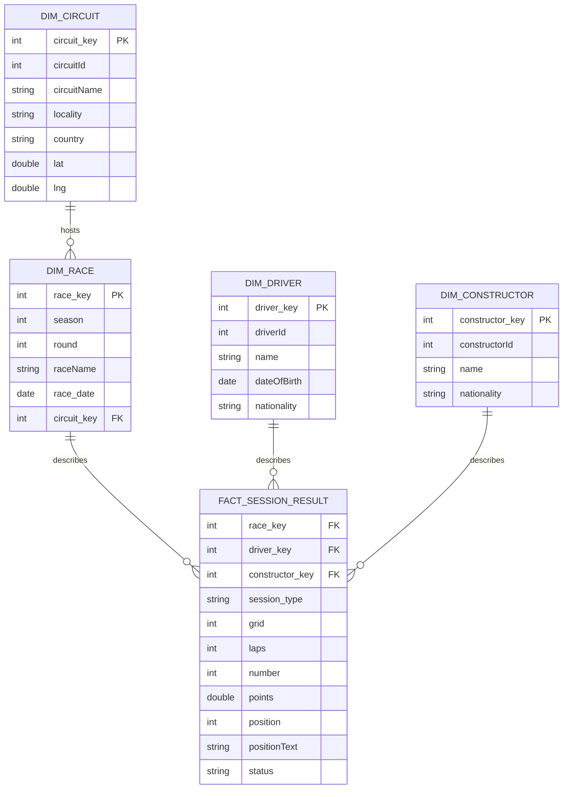
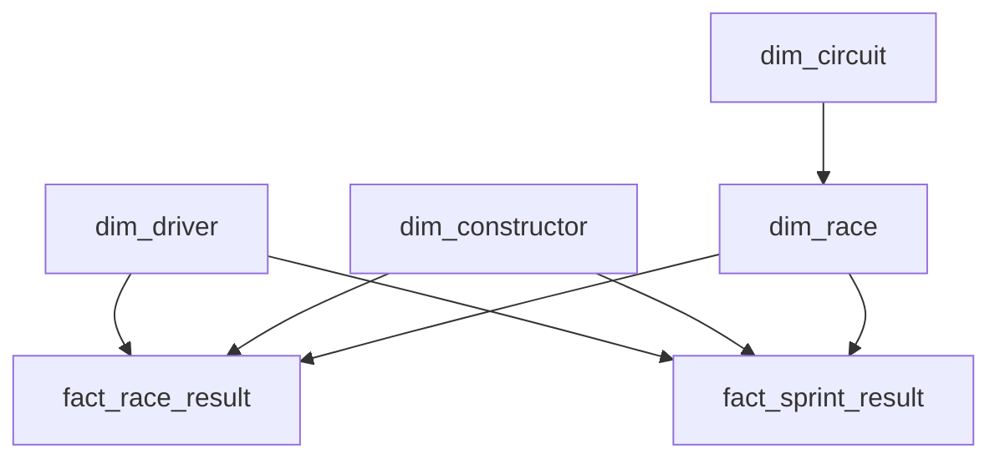

# 09 — Gold Dimensional Model

The supplied screenshots show a business-ready dimensional direction for the Gold layer. The safest interpretation is a star schema built from descriptive dimensions and performance facts.

## Conceptual star schema

The surrogate keys above are a dimensional-model recommendation, not a claim that those exact physical columns are visible in the screenshots. The source identifiers should remain available as business/natural keys.

## Alternative physical design

If the implementation shown in the catalog keeps race and sprint facts separate, the Gold layer can instead expose two facts:

## Grain must remain explicit

A Gold fact should have a declared grain. For a unified session fact:

> One row per race weekend, session type, constructor and driver.

For separate facts:

- `fact_race_result`: one row per `(season, round, constructor, driver)` for the main race.
- `fact_sprint_result`: one row per `(season, round, constructor, driver)` for the sprint session.

## Typical analytical questions

The Gold layer should make questions such as the following simple and stable:

- points by driver, constructor, race and season;
- finishing position trends;
- grid-to-finish movement;
- race versus sprint performance;
- results by circuit/country;
- constructor and driver performance across seasons.

Next: [10 — Databricks and Unity Catalog](10_databricks_unity_catalog.md)
