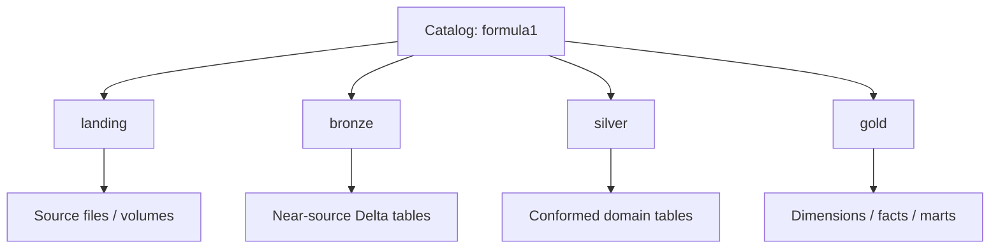
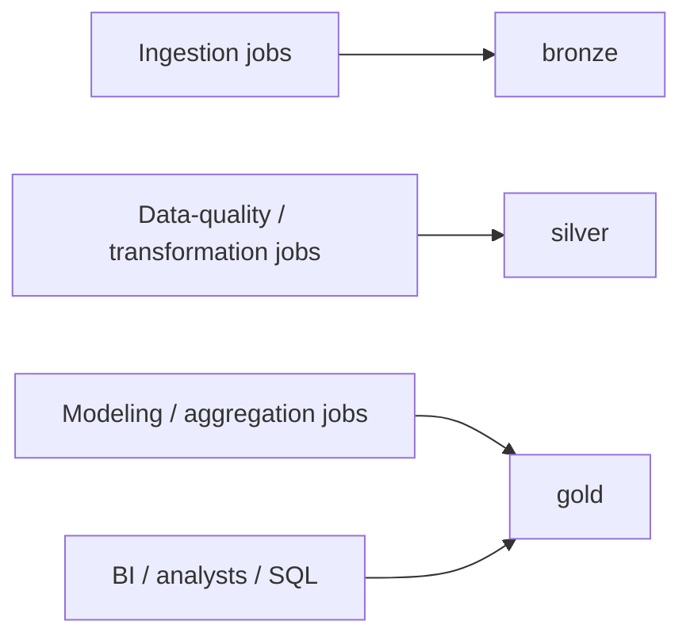

# 10 — Databricks and Unity Catalog Organization

One screenshot shows the Formula 1 project organized in Databricks with schemas corresponding to Lakehouse layers. The visible structure supports a catalog-level organization such as `formula1` with layer schemas including `bronze`, `silver`, `gold`, and a landing area.

## Logical catalog hierarchy



## Recommended namespace pattern

```text
formula1
├── landing
│   └── volumes / source deliveries
├── bronze
│   ├── circuits
│   ├── races
│   ├── constructors
│   ├── drivers
│   ├── results
│   └── sprints
├── silver
│   └── cleaned and conformed domain tables
└── gold
    └── analytical dimensions and facts
```

Only names that are clearly supported by the provided material are treated as definitive; exact physical Gold/Silver table names should be verified against the active catalog before production documentation is frozen.

## Ownership boundaries



This separation also maps naturally to permissions: ingestion writers need Bronze access, transformation workloads need Bronze-read/Silver-write, and most consumers can be restricted to Gold.

Next: [11 — End-to-End Walkthrough](11_end_to_end_walkthrough.md)
