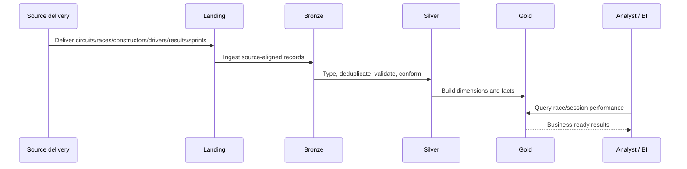
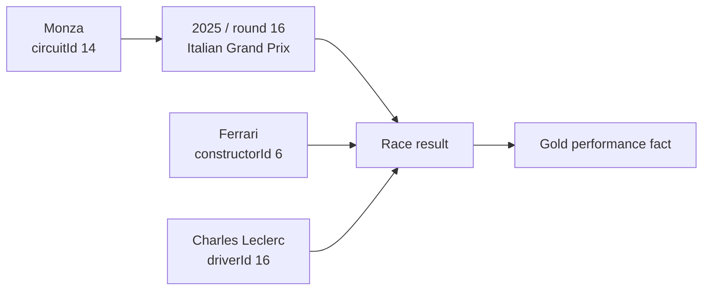

# 11 — End-to-End Walkthrough

The original documentation provides a concrete Monza/Ferrari/Charles Leclerc example. It is retained below and then extended across the Lakehouse layers.

## 12. End-to-end example

Assume the following source entities exist.

### Circuit

```text
circuitId  = 14

circuitName = Monza

country     = Italy
```

### Race

```text
season    = 2025

round     = 16

raceName  = Italian Grand Prix

circuitId = 14
```

The race references the circuit:

```text
races.circuitId = circuits.circuitId
```

### Constructor

```text
constructorId = 6

name          = Ferrari
```

### Driver

```text
driverId = 16

name     = Charles Leclerc
```

### Result

```text
season        = 2025

round         = 16

constructorId = 6

driverId      = 16

grid          = 2

laps          = 53

points        = 25

position      = 1

status        = Finished
```

This result record can be interpreted through its relationships:

```text
season + round

    → Italian Grand Prix

constructorId

    → Ferrari

driverId

    → Charles Leclerc

circuitId through races

    → Monza
```

The full business statement is:

> Charles Leclerc drove for Ferrari in the 2025 Italian Grand Prix at Monza and finished first.

---

## Layer-by-layer journey



## Example lineage



The key idea is that the business statement is reconstructed through relationships rather than by treating the result record as a standalone object.

Next: [12 — Validation and Data Quality](12_validation_and_data_quality.md)
