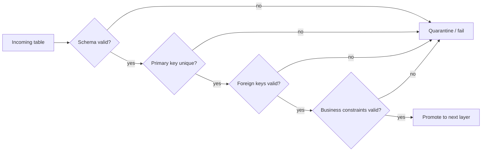
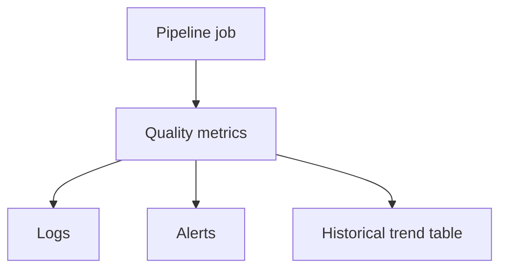

# 12 — Validation and Data Quality

The raw ERD already encodes the most important data-quality rules. In a Lakehouse implementation, those rules should become automated checks at ingestion and transformation boundaries.

## Quality-gate pipeline

## Minimum automated checks

| Check | Applies to | Expected rule |
| --- | --- | --- |
| Unique circuit | `circuits` | `circuitId` unique |
| Unique race | `races` | `(season, round)` unique |
| Valid circuit reference | `races` | every `circuitId` exists in `circuits` |
| Unique constructor | `constructors` | `constructorId` unique |
| Unique driver | `drivers` | `driverId` unique |
| Valid race reference | `results`, `sprints` | `(season, round)` exists in `races` |
| Valid constructor reference | `results`, `sprints` | `constructorId` exists in `constructors` |
| Valid driver reference | `results`, `sprints` | `driverId` exists in `drivers` |
| Unique result | `results` | composite result key unique |
| Unique sprint result | `sprints` | composite sprint key unique |

## Additional conformance checks

Because race information is repeated in raw result datasets, Silver should compare `raceName`, `date`, and `url` against the corresponding race record and surface mismatches rather than silently overwriting them.

## Observability

Recommended operational metrics include row counts, rejected rows, duplicate counts, orphaned foreign keys, schema changes, null-rate changes and source-to-target reconciliation counts.

Next: [13 — Design Rationale](13_design_rationale.md)
