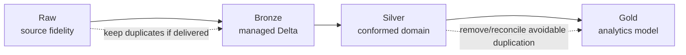

# 13 — Design Rationale and Evolution

## 14. Why some information is duplicated

The `results` and `sprints` tables contain:

```text
date

raceName

url
```

However, similar information already exists in `races`.

This creates source-level duplication.

For example:

```text
races.raceName

results.raceName

sprints.raceName
```

In a normalized relational model, the result tables would normally reference the race and would not repeat all race attributes.

However, this is a raw source model. Keeping these fields is reasonable because it:

* preserves the original source payload;

* avoids changing the source structure during ingestion;

* supports source validation;

* makes it possible to compare repeated source values;

* provides evidence of exactly what was delivered.

The duplicate fields can be removed or standardized later in the Silver layer.

---

## 15. Why `results` and `sprints` are separate

Both entities have nearly identical structures, but they represent different session types.

```text
results = main race results

sprints = sprint-session results
```

Keeping them separate in the raw layer has several benefits:

* the original source datasets remain unchanged;

* race and sprint records cannot be confused;

* ingestion logic can process each source independently;

* source-specific errors are easier to identify;

* no additional `sessionType` field must be introduced during raw ingestion.

They may later be combined in the Gold layer by adding a field such as:

```text
session_type = RACE

session_type = SPRINT
```

---

## 16. Raw data model summary

| Entity         | Grain                                | Primary key                                    | Main relationship                          |
| -------------- | ------------------------------------ | ---------------------------------------------- | ------------------------------------------ |
| `circuits`     | One circuit                          | `circuitId`                                    | Referenced by `races`                      |
| `races`        | One season and round                 | `season`, `round`                              | References `circuits`                      |
| `constructors` | One constructor                      | `constructorId`                                | Referenced by `results` and `sprints`      |
| `drivers`      | One driver                           | `driverId`                                     | Referenced by `results` and `sprints`      |
| `results`      | One driver-constructor race result   | `season`, `round`, `constructorId`, `driverId` | References races, constructors and drivers |
| `sprints`      | One driver-constructor sprint result | `season`, `round`, `constructorId`, `driverId` | References races, constructors and drivers |

The raw ERD establishes the source-level structure of the Formula 1 platform. `circuits`, `constructors`, and `drivers` provide descriptive entities; `races` identifies the event; and `results` and `sprints` store the measurable session outcomes.

## Evolution path



## Key design principles

1. Preserve source fidelity before optimization.
2. Declare grain and keys for every table.
3. Do not mix source semantics with business semantics in the same layer.
4. Validate relationships before promoting data.
5. Keep race and sprint lineage explicit even if an analytical union is later introduced.
6. Build Gold for consumption, not for reconstructing ingestion history.

Next: [14 — Glossary](14_glossary.md)
